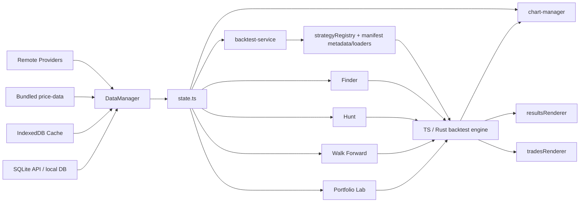

# Strategies Finder

Strategies Finder is a Vite + TypeScript trading research playground for building, testing, comparing, and validating strategy ideas on chart data.

It combines:
- a browser UI assembled from HTML partials at runtime
- a TypeScript backtest engine with optional Rust acceleration
- a multi-source data pipeline with local caching
- research tools such as Finder, Exit Strategy Override, Hunt, Walk Forward, Monte Carlo, Scanner, Replay, Pair Combiner, Portfolio Lab, and Strategy Ensemble Lab
- optional Cloudflare Worker alerting and subscription execution

## What You Can Do Here
- Load market data from local SQLite, IndexedDB, bundled price files, or remote providers
- Run backtests with realistic execution settings and risk controls
- Switch between fixed, percent, Kelly, volatility-targeted, risk-parity, martingale, and Optimal f sizing models from the settings panel
- Compare strategies, inspect trades, and review backtest result diagnostics, including entry and exit timing quality
- Search parameter spaces with Finder, including random and genetic modes, and rank current-chart grid/random runs by Entry Score or Exit Score
- Batch Finder runs across reusable Hunt profiles and compare survivor candidates across symbols, intervals, and execution settings
- Validate robustness with walk-forward analysis and latest-OOS checks
- Stress trade-path robustness with Monte Carlo sequence randomization, bootstrap resampling, and Polymarket bankroll survivability on annotated runs
- Use Quick View to inspect backtest stats, trades, Polymarket scoring, and Polymarket payout diagnostics, including native `15m` / `1h` session summaries, same-event signal-exit metrics on supported `1m` runs, and exact-second CLOB metrics on supported `1s` runs
- Paper trade selected `1s` candidates in Execution Lab with live Binance candles, live Polymarket CLOB quotes, chart overlays, and JSONL logs; optionally live-trade through a local secret-bearing Polymarket executor after dry-run preflight
- Run Portfolio Lab across multiple pairs for context, ranking, and sizing decisions
- Build live or scheduled alert subscriptions through the Worker API

Trade timing quality scores are descriptive diagnostics. Exit Score is measured on each strategy's own trades; it is not an isolated exit-rule benchmark.

## Quick Start

### Requirements
- Node.js 20+ recommended
- npm
- Windows PowerShell works well in this repo

### Install and Run
```bash
npm install
npm run dev
```

Open the Vite URL shown in the terminal, usually `http://localhost:5173`.

### First Useful Smoke Check
1. Pick a symbol and timeframe.
2. Select a strategy from the dropdown.
3. Click `Run Backtest`.
4. Open `Trades`, `Results`, `Finder`, `Hunt`, and `Walk Forward` to verify the feature panels loaded.
5. Open `Monte Carlo` after a backtest to inspect drawdown tails and ruin probability under reshuffled paths, or run Polymarket Monte Carlo on annotated runs to estimate ending bankroll survivability.

## Architecture Map

### Bootstrap and layout
- Entry: `index.ts`
- Bootstrap registry: `lib/app-bootstrap.ts`
- Dependency/stage runner: `lib/bootstrap-feature-registry.ts`
- Runtime layout injection: `lib/layout-manager.ts`
- Runtime HTML source: `html-partials/*`
- Feature wiring: `lib/handlers/*`

### Data and runtime state
- Data manager: `lib/data-manager.ts`
- Data providers: `lib/dataProviders/*`
- Browser caches: `lib/candle-cache.ts`, IndexedDB paths
- Local SQLite API client: `lib/local-sqlite-api.ts`
- Versioned localStorage helper: `lib/persisted-json.ts`
- Shared runtime state: `lib/state.ts`
- State write surface: `lib/state-actions.ts`
- Domain selectors: `lib/state-domains.ts`

### Strategy and backtest engine
- Strategy registry and loading: `strategyRegistry.ts`
- Built-in source of truth: `lib/strategies/lib/*`, with generated metadata/loaders/eager manifests under `lib/strategies/manifest*.ts`
- Browser built-in loading: summary metadata and per-key loaders from `lib/strategies/manifest-summary.ts` and `lib/strategies/manifest-loaders.ts`
- Worker/test eager built-in library: `lib/strategies/library.ts`
- Backtest orchestration/UI: `lib/backtest-service.ts`
- Backtest run feedback presenter: `lib/backtest-run-presenter.ts`
- TS engine: `lib/strategies/backtest/*`
- Rust engine client: `lib/rust-engine-client.ts`

### Chart and renderer layer
- Chart controller: `lib/chart-manager.ts`
- Results renderer: `lib/renderers/resultsRenderer.ts`
- Trades renderer: `lib/renderers/tradesRenderer.ts`
- Backtest analysis helpers: `lib/backtest-result-analysis.ts`

### Research tools
- Finder: `lib/finder-manager.ts`, `lib/finder/*`
- Hunt: `lib/hunt/*`
- Walk Forward: `lib/walk-forward-service.ts`
- Monte Carlo: `lib/monte-carlo-service.ts`, `lib/strategies/monte-carlo/*`
- Portfolio Lab: `lib/portfolio-lab-service.ts`
- Execution Lab: `lib/execution-lab/*`
- Scanner: `lib/scanner/*`
- Replay: `lib/replay/*`
- Pair Combiner bridge: `lib/pairCombiner/*`
- Data Mining / feature export: `lib/data-mining-manager.ts`, `lib/featureLab/*`
- Strategy Ensemble Lab: `lib/strategy-ensemble-service.ts`
- Polymarket research / scoring: `lib/polymarket-outcome-evaluator.ts`, `lib/polymarket-signal-exit-evaluator.ts`, `lib/polymarket-price-points-ingest.ts`, `scripts/polymarket-sync-outcomes.ts`

### Alerts / Worker
- Worker: `workers/entry-signal-worker.ts`
- API client: `lib/alert-service.ts`
- Worker docs: `workers/README.md`

## Architecture Flow



## How It Boots
1. `index.ts` delegates startup to `lib/app-bootstrap.ts`.
2. The bootstrap registry injects the runtime HTML layout from `html-partials/*`.
3. Strategy metadata and saved custom strategies are loaded, with built-in strategy code loaded on demand; then the chart layer and feature managers are initialized in dependency order.
4. Saved settings are restored and applied back into UI state and feature state.
5. Initial market data is loaded, after which reactive state updates drive chart, backtest, and renderer refreshes.

## UI Structure

This app is heavily id-driven.

The important rule is:
- markup lives in `html-partials/*`
- binding happens in `lib/handlers/*`, feature managers, and renderers
- required structural ids are defined in feature-local `*-dom.ts` modules next to their handlers, renderers, or services
- `lib/feature-dom-contracts.ts` is a compatibility barrel that re-exports those feature-local contracts
- the smoke test `tests/feature-dom-contracts.spec.ts` fails if a required id disappears from the partials

If you rename a UI id, update the partial, the feature DOM contract, and the consuming code together.

## Data Flow and Caching

`DataManager` currently prefers:
1. local SQLite cache via Vite `/api/sqlite/*`
2. IndexedDB cache
3. bundled `price-data/*`
4. remote fetch from provider

This ordering matters because Finder, Scanner, and repeated backtests depend on fast warm-cache reads.

## Important Contracts

### Strategy registration is split
- UI and runtime loading use `strategyRegistry`
- Built-in source of truth is `lib/strategies/lib/*`, with generated metadata, loader, key, and eager manifest files under `lib/strategies/manifest*.ts`
- Browser UI listing uses `manifest-summary.ts`; browser strategy execution loads code through `manifest-loaders.ts`
- `lib/strategies/library.ts` uses the eager manifest and is what worker-side evaluation imports

If you add or rename a built-in strategy, run `npm run strategies:sync-manifest` or the strategy will not load consistently.

### Settings compatibility is real
- persisted JSON blobs now route through `lib/persisted-json.ts`, which supports schema/version envelopes while still reading legacy raw JSON payloads
- removed trade-filter settings may still appear in old saved payloads; ignore them instead of restoring behavior
- any new setting unsupported by Rust must be stripped in both:
  - `lib/backtest-service.ts`
  - `lib/finder-manager.ts`

### Time handling is broad
The code accepts unix seconds, unix milliseconds, ISO strings, and `BusinessDay` objects.

Reuse existing helpers instead of inventing new conversions:
- `timeKey`
- `timeToNumber`
- existing parse/normalize helpers in backtest and data utilities

### Execution realism matters
- percentage and ATR take-profit exits are capped at the configured target price once touched
- stop-loss exits can still fill worse at the bar open when price gaps through the stop
- historical-level TP and protective exits are resolved from confirmed pre-entry pivot zones, then run through the same conservative stop/TP ordering
- `next_open` runs impose a 1-bar re-entry cooldown after a full `signal` exit, so same-bar re-entries are blocked and the earliest new entry is the next bar
- if you need tighter execution realism than OHLC can provide, validate with lower-timeframe or tick data

## Common Workflows

### Strategy authoring
Built-in strategy authoring has enough contract surface to deserve its own guide.

Use:
- [`docs/strategy-authoring.md`](docs/strategy-authoring.md) for the template, normalization rules, and common failure modes
- [`docs/cross-symbol.md`](docs/cross-symbol.md) for the cross-symbol runtime contract, support matrix, and change map
- [`docs/synthetic-pairs.md`](docs/synthetic-pairs.md) for generating synthetic pair data (e.g. BNBPAXG) for backtest and Finder research
- [`docs/backtest-endpoint.md`](docs/backtest-endpoint.md) for local HTTP backtest usage, payload examples, and parity rules
- [`AGENTS.md`](AGENTS.md) for the operational checklist and validation habits

Endpoint note:
- the HTTP backtest endpoint intentionally uses one fixed sizing profile only: `$1000` per trade with `0.1%` commission
- single-run endpoint responses are slim and expose compact `polymarketPerformance` only when Polymarket annotation is enabled and outcome data exists
- the UI `Preview Endpoint` and `Copy Endpoint` actions are the preferred parity path because they reuse the exact latest UI backtest snapshot, upload the matching dataset, include the resolved secondary dataset for cross-symbol runs, and auto-enable Polymarket annotation for supported runs

The short version:
1. Create `lib/strategies/lib/<strategy-key>.ts`.
2. Export a valid `Strategy`.
3. Run `npm run strategies:sync-manifest`.
4. Keep `normalizeParams(...)` aligned with `execute(...)`.
5. Run `npm run typecheck` and confirm the strategy appears in the UI.
6. To remove built-in strategies from disk, use `Library Tools` in the Settings tab. It can delete the current strategy or a pasted bulk list of keys, names, or filenames, archives each file to `archive/strategy/*`, and re-syncs `lib/strategies/manifest.ts` automatically.

Dev note:
- `npm run dev` ignores `lib/strategies/**` changes by default so Finder/Hunt work is not interrupted while you author or edit strategies.
- After strategy edits, run `npm run strategies:sync-manifest` if needed and do a manual browser refresh when you are ready to load the new code.
- Set `WATCH_STRATEGIES=1` before starting Vite if you want live reload for `lib/strategies/**` again.

For strategy-idea generation via [`archive/prompt.txt`](archive/prompt.txt), keep the allowed helper surface aligned with real exported strategy-layer utilities. Favor low-complexity price, bar-geometry, crossover, pivot, and timeframe-alignment helpers before heavier transforms, and keep prompt-specific quality filters inside the prompt file rather than expanding the repo-level README.

### Use Portfolio Lab effectively
Portfolio Lab is most useful when you separate decision outputs from diagnostics.

High-signal outputs:
- `Current Context`
- `Open Trade Forecast`
- `Execution Filters`
- `Pair Ranking`
- `Sizing Scenarios`

Lower-signal diagnostics:
- aggregate agreement-bucket tables
- raw correlation matrices
- full per-pair diagnostics tables

Recommended workflow:
1. Run Portfolio Lab in `Common Overlap` mode when fair pair comparison matters.
2. Start from `Current Context`, then `Open Trade Forecast`, then `Execution Filters`.
3. Compare expectancy, net, and drawdown separately instead of chasing only win rate.
4. Use diagnostics to confirm diversification only after you already have a decision.

### Use Strategy Ensemble Lab carefully
- context votes come from entry-capable signals, not raw signal spam
- agreement and opposition are aggregated by strategy family, not by every near-duplicate saved config
- target filtering preserves target exits and only gates target entries
- if no validation survivor exists, the UI explicitly labels the fallback as `In-Sample Candidate`

### Evaluate Polymarket Outcomes
Automate the inspection of executed chart trades against historical Polymarket crypto event resolution and locally cached CLOB quotes.
Implementation notes live in [`docs/polymarket.md`](docs/polymarket.md).
1. Sync closed Polymarket matching events to your local SQLite database using `npm run poly:sync-outcomes:all` for every supported 5m symbol, or `npm run poly:sync-outcomes` / the direct `esno` command for a single symbol (requires the Vite server running via `npm run dev`).
2. Use the normal backtest, Finder, or Hunt surfaces for full Polymarket parity. The older headless helper `evaluatePolymarketOutcomes` in `lib/polymarket-outcome-evaluator.ts` still represents the resolve-hold outcome-only path.
3. Choose `Polymarket Exit Mode` in Polymarket Settings:
   - `Resolve Hold` keeps the original final-outcome scoring path.
   - `Signal Exit Same Event` is available on `1m` + `next_open` runs and on supported `1s` BTCUSDT/XRPUSDT CLOB runs with `signal_close`, `next_open`, or `next_close`.
4. For `1s` BTCUSDT/XRPUSDT runs, keep `scripts/run-1s-miner.bat` running first. The chart and Finder load Binance candles from `price-data/1second-chart/second-market-data.sqlite`, and Polymarket scoring uses exact-second CLOB bid/ask rows from the same DB. The standalone miner launchers use AdGuard DNS-over-HTTPS for Binance host lookup by default; pass `--binance-dns system` to use the OS resolver instead. The Execution Lab UI miner button defaults to system DNS; set `SECOND_MARKET_BINANCE_DNS=adguard-doh` before `npm run dev` to force AdGuard for UI-launched miners.
5. For chart-exact parity, pass the same backtest and capital settings you use in the UI. The helper scores executed trades, not raw signals.
6. The supported Polymarket 5m outcome target series are `BTCUSDT`, `ETHUSDT`, `SOLUSDT`, and `XRPUSDT`. The chart symbol can differ if you set `Polymarket Outcome Symbol` to one of those targets.
7. Use `npm run poly:sync-outcomes:all` to backfill every supported 5m outcome series, or `..\..\..\node_modules\.bin\esno scripts\polymarket-sync-outcomes.ts --symbol <BTCUSDT|ETHUSDT|SOLUSDT|XRPUSDT>` for a single series.
8. `1m` signal-exit runs ensure local Polymarket price points on demand through the SQLite/Vite path; outcome rows still need the normal sync step above.
9. Use the `Polymarket` strategy-panel tab to inspect scored-run diagnostics. The same panel also has the separate bridge export workflow for `external_signal`.
10. Endpoint Preview / Copy and Strategy Ensemble still stay on `resolve_hold`; the new signal-exit mode is a backtest, Finder, Hunt, Quick View, Trades, and Polymarket diagnostics feature.
11. The symbol search accepts custom Polymarket event URLs or slugs. Append `:yes` or `:no`, or use the URL `outcome` / `side` query param, to choose the side.
12. The `PM` control in the timeframe bar prompts for a Polymarket slug or URL when needed, then opens the market at the supported `1m` chart resolution.

### Run Execution Lab Paper Or Live Trade
Execution Lab is the only browser surface that can dispatch live Polymarket orders. Paper Trade remains the default.

Operational contract:
- run it on supported `1s` BTCUSDT/XRPUSDT charts with `signal_close`, `next_open`, or `next_close` Polymarket CLOB timing
- browser code sends only order intent; wallet secrets stay in the local executor process environment
- configure Strategy Finder `.env` with `EXECUTION_LAB_LIVE_EXECUTOR_PATH`, optional `EXECUTION_LAB_LIVE_EXECUTOR_URL`, `EXECUTION_LAB_LIVE_ENABLED`, fallback order settings, optional broad cancel scope, and local stake caps; if the HTTP executor URL is unreachable and the CLI path/cwd are valid, Strategy Finder falls back to the one-shot CLI executor; non-secret order mode, taker type, sizing, slippage, limit offset, fixed limit cap, and cancel-on-exit can be controlled in the Execution Lab UI
- if the executor binary is not under the side repo's `target/debug` or `target/release`, also set `EXECUTION_LAB_LIVE_EXECUTOR_CWD` to the side repo root so its `.env` is loaded
- configure the side executor repo with `POLYMARKET_PRIVATE_KEY`, `MAX_ORDER_SIZE_USDC`, `ARBITRAGE_ORDER_TYPE=FAK`, `FOK`, or `GTC`, `DRY_RUN=false`, and `LIVE_TRADE_ONCE_LIVE_ENABLED=1` only after dry-run preflight is correct
- live entry buys the same YES/NO token accepted by the paper decision path; limit mode submits a resting entry and does not become a tracked live position unless the executor reports filled shares
- live exit sells the tracked filled token shares when the matching paper trade emits `paper_exit`; it does not buy the opposite outcome as a hedge
- limit cancel-on-exit targets known posted Strategy Finder order ids by default; broad account cancellation requires explicit scope configuration and is shown in UI status and logs
- rejected or failed exits can retry with fresh request ids while the event remains tradeable; ambiguous accepted states such as `delayed` or `posted_live` stop blind retries until reconciled

Use [`docs/live-trade-plan.md`](docs/live-trade-plan.md) for the Strategy Finder side and `STRATEGY_FINDER_LIVE_TRADE.md` in the Polymarket bot repo for the executor side.

### Export Latest Entry Signal
Use the CLI exporter to produce a small local JSON contract for downstream consumers such as the Polymarket bot `external_signal` mode.

Example:
```bash
npm run signal:export -- --strategy classic_nr7_breakout_surge --symbol BTCUSDT --interval 5m --bars 500 --out signals/latest-entry-signal.json
```

Useful flags:
- `--params <json>` or `--params-file <path>`
- `--backtest-settings <json>` or `--backtest-settings-file <path>`
- `--capital-settings <json>` or `--capital-settings-file <path>`
- `--freshness-bars <n>`

The exporter uses Binance candles plus the same latest-entry evaluation logic used by the Worker/alert path, then writes a single JSON file containing the newest valid backtest entry signal if one exists.

For the Polymarket bot bridge, use the `Polymarket` tab with a saved configuration selected. The bridge export downloads a ready-to-run PowerShell setup script that writes:
- `signals/bridge/<config>.params.json`
- `signals/bridge/<config>.backtest.json`
- `signals/bridge/<config>.capital.json`
- `signals/bridge/<config>.latest-entry-signal.json`
- `signals/bridge/<config>.refresh.ps1`
- `signals/bridge/<config>.bot.env`

The exported `latest-entry-signal.json` preserves the selected `polymarketEntryOffset` when the bridge config carries a 1m Polymarket offset, so downstream `external_signal` consumers can read the minute alignment directly from the payload.

The generated `<config>.refresh.ps1` is intended for unattended refresh. Point the bot's `EXTERNAL_SIGNAL_REFRESH_SCRIPT` at that file and it can regenerate the latest signal automatically on each new 5-minute bucket.

### Change UI safely
1. Add or update markup in `html-partials/*`.
2. Add the required id to the matching feature-local `*-dom.ts` contract if it is structural.
3. Wire the feature through its typed DOM contract.
4. Run typecheck and the DOM-contract smoke test.

### Work on alerts / subscriptions
- Read `workers/README.md`
- Keep `workers/entry-signal-worker.ts` aligned with `lib/alert-service.ts`
- Add a worker migration for schema changes

## Troubleshooting

### UI looks stale after Vite HMR
This app has singleton managers and runtime-injected partials. If a panel or shortcut behaves inconsistently after hot reload, do a full page refresh before assuming the code is wrong.

### Data looks stale or inconsistent
The app prefers warm caches. If fresh remote data is not appearing, check the local SQLite and IndexedDB paths first before debugging the provider code.

### Rust engine never connects
Check the engine status indicator and the Rust sanitization path. Unsupported settings must be stripped in both `lib/backtest-service.ts` and `lib/finder-manager.ts`.

### UI ids suddenly break
Run:
```bash
npm run typecheck
..\..\..\node_modules\.bin\esno tests\feature-dom-contracts.spec.ts
```

## Validation Commands

Run from this directory.

```bash
npm run typecheck
npm run typecheck:tests
npm run test
npm run test:e2e
```

`npm run test` uses a compact wrapper that discovers `tests/**/*.spec.ts`, excludes `tests/e2e.spec.ts`, prints one status line per spec, and writes full per-spec logs to `artifacts/test-logs/latest`. `artifacts/test-logs/latest/summary.json` contains the machine-readable summary for agent or tooling use.
`npm run verify` runs typecheck, staged test typecheck, and the compact test suite.

Useful variants:
```bash
npm run test:verbose
npm run test:json
npm run test -- --runInBand
npm run test -- --jobs=4
npm run test -- backtesting-engine
```

Useful extras:
```bash
..\..\..\node_modules\.bin\esno tests\feature-dom-contracts.spec.ts
..\..\..\node_modules\.bin\esno tests\pairCombiner.spec.ts
```

## Specialized Project Docs

These are intentionally narrower than the repo itself:
- `AGENTS.md`: safe-change handbook for coding agents
- `docs/backtest-endpoint.md`: local backtest endpoint usage and request contract
- `docs/polymarket.md`: Polymarket scoring, signal-exit, diagnostics, bridge, and Execution Lab live-trade contracts
- `docs/live-trade-plan.md`: Execution Lab live-trade executor boundary, request/response schema, and safety plan
- `docs/strategy-authoring.md`: built-in strategy authoring guide
- `workers/README.md`: Worker endpoints, cron behavior, D1 setup, Telegram
- `DEPLOY_TO_VERCEL.md`: deployment notes
