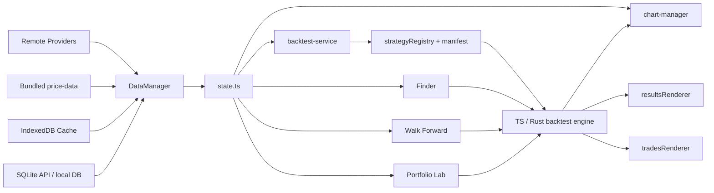

# Strategies Finder

Strategies Finder is a Vite + TypeScript trading research playground for building, testing, comparing, and validating strategy ideas on chart data.

It combines:
- a browser UI assembled from HTML partials at runtime
- a TypeScript backtest engine with optional Rust acceleration
- a multi-source data pipeline with local caching
- research tools such as Finder, Walk Forward, Scanner, Replay, Pair Combiner, Portfolio Lab, and Strategy Ensemble Lab
- optional Cloudflare Worker alerting and subscription execution

## What You Can Do Here
- Load market data from local SQLite, IndexedDB, bundled price files, or remote providers
- Run backtests with realistic execution settings, risk controls, and snapshot filters
- Compare strategies, inspect trades, and review backtest result diagnostics
- Search parameter spaces with Finder, including random, genetic, and `robust_random_wf`
- Validate robustness with walk-forward analysis and latest-OOS checks
- Audit parameter usefulness and redundancy with `Parameter Audit`
- Run Portfolio Lab across multiple pairs for context, ranking, and sizing decisions
- Build live or scheduled alert subscriptions through the Worker API

## Quick Start

### Requirements
- Node.js 20+ recommended
- npm
- Windows PowerShell works well in this repo

### Install and Run
```bash
npm install
npm run dev
```

Open the Vite URL shown in the terminal, usually `http://localhost:5173`.

### First Useful Smoke Check
1. Pick a symbol and timeframe.
2. Select a strategy from the dropdown.
3. Click `Run Backtest`.
4. Open `Trades`, `Results`, `Finder`, and `Walk Forward` to verify the feature panels loaded.

## Architecture Map

### Bootstrap and layout
- Entry: `index.ts`
- Runtime layout injection: `lib/layout-manager.ts`
- Runtime HTML source: `html-partials/*`
- Feature wiring: `lib/handlers/*`

### Data and runtime state
- Data manager: `lib/data-manager.ts`
- Data providers: `lib/dataProviders/*`
- Browser caches: `lib/candle-cache.ts`, IndexedDB paths
- Local SQLite API client: `lib/local-sqlite-api.ts`
- Shared runtime state: `lib/state.ts`

### Strategy and backtest engine
- Strategy registry and loading: `strategyRegistry.ts`
- Built-in source of truth: `lib/strategies/manifest.ts`
- Worker-facing built-in library: `lib/strategies/library.ts`
- Backtest orchestration/UI: `lib/backtest-service.ts`
- TS engine: `lib/strategies/backtest/*`
- Rust engine client: `lib/rust-engine-client.ts`

### Chart and renderer layer
- Chart controller: `lib/chart-manager.ts`
- Results renderer: `lib/renderers/resultsRenderer.ts`
- Trades renderer: `lib/renderers/tradesRenderer.ts`
- Backtest analysis helpers: `lib/backtest-result-analysis.ts`

### Research tools
- Finder: `lib/finder-manager.ts`, `lib/finder/*`
- Walk Forward: `lib/walk-forward-service.ts`
- Portfolio Lab: `lib/portfolio-lab-service.ts`
- Scanner: `lib/scanner/*`
- Replay: `lib/replay/*`
- Pair Combiner: `lib/pair-combiner-manager.ts`, `lib/pairCombiner/*`
- Data Mining / feature export: `lib/data-mining-manager.ts`, `lib/featureLab/*`
- Strategy Ensemble Lab: `lib/strategy-ensemble-service.ts`
- Polymarket Evaluator: `lib/polymarket-outcome-evaluator.ts`, `scripts/polymarket-sync-outcomes.ts`

### Alerts / Worker
- Worker: `workers/entry-signal-worker.ts`
- API client: `lib/alert-service.ts`
- Worker docs: `workers/README.md`

## Architecture Flow



## How It Boots
1. `index.ts` injects the runtime HTML layout from `html-partials/*`.
2. Built-in and saved custom strategies are loaded, then the chart layer is initialized.
3. State subscriptions and feature managers are wired, including Finder, Walk Forward, Scanner, Data Mining, Portfolio Lab, and Ensemble.
4. Saved settings are restored and applied back into UI state and feature state.
5. Initial market data is loaded, after which reactive state updates drive chart, backtest, and renderer refreshes.

## UI Structure

This app is heavily id-driven.

The important rule is:
- markup lives in `html-partials/*`
- binding happens in `lib/handlers/*`, feature managers, and renderers
- required structural ids are defined in `lib/feature-dom-contracts.ts`
- the smoke test `tests/feature-dom-contracts.spec.ts` fails if a required id disappears from the partials

If you rename a UI id, update the partial, the feature DOM contract, and the consuming code together.

## Data Flow and Caching

`DataManager` currently prefers:
1. local SQLite cache via Vite `/api/sqlite/*`
2. IndexedDB cache
3. bundled `price-data/*`
4. remote fetch from provider

This ordering matters because Finder, Scanner, and repeated backtests depend on fast warm-cache reads.

## Important Contracts

### Strategy registration is split
- UI and runtime loading use `strategyRegistry`
- Built-in source of truth is `lib/strategies/manifest.ts`
- `lib/strategies/library.ts` is derived from that manifest and is what worker-side evaluation imports

If you add or rename a built-in strategy, update `lib/strategies/manifest.ts` or the strategy will not load consistently.

### Settings compatibility is real
- `tradeFilterMode` is canonical
- `entryConfirmation` still exists as compatibility baggage in some paths
- any new setting unsupported by Rust must be stripped in both:
  - `lib/backtest-service.ts`
  - `lib/finder-manager.ts`

### Time handling is broad
The code accepts unix seconds, unix milliseconds, ISO strings, and `BusinessDay` objects.

Reuse existing helpers instead of inventing new conversions:
- `timeKey`
- `timeToNumber`
- existing parse/normalize helpers in backtest and data utilities

### Execution realism matters
- percentage and ATR take-profit exits are capped at the configured target price once touched
- stop-loss exits can still fill worse at the bar open when price gaps through the stop
- if you need tighter execution realism than OHLC can provide, validate with lower-timeframe or tick data

## Common Workflows

### Strategy authoring
Built-in strategy authoring has enough contract surface to deserve its own guide.

Use:
- [`docs/strategy-authoring.md`](docs/strategy-authoring.md) for the template, normalization rules, and common failure modes
- [`AGENTS.md`](AGENTS.md) for the operational checklist and validation habits

The short version:
1. Create `lib/strategies/lib/<strategy-key>.ts`.
2. Export a valid `Strategy`.
3. Register it in `lib/strategies/manifest.ts`.
4. Keep `normalizeParams(...)` aligned with `execute(...)`.
5. Run `npm run typecheck` and confirm the strategy appears in the UI.

### Use Portfolio Lab effectively
Portfolio Lab is most useful when you separate decision outputs from diagnostics.

High-signal outputs:
- `Current Context`
- `Open Trade Forecast`
- `Execution Filters`
- `Pair Ranking`
- `Sizing Scenarios`

Lower-signal diagnostics:
- aggregate agreement-bucket tables
- raw correlation matrices
- full per-pair diagnostics tables

Recommended workflow:
1. Run Portfolio Lab in `Common Overlap` mode when fair pair comparison matters.
2. Start from `Current Context`, then `Open Trade Forecast`, then `Execution Filters`.
3. Compare expectancy, net, and drawdown separately instead of chasing only win rate.
4. Use diagnostics to confirm diversification only after you already have a decision.

### Use Strategy Ensemble Lab carefully
- context votes come from entry-capable signals, not raw signal spam
- agreement and opposition are aggregated by strategy family, not by every near-duplicate saved config
- target filtering preserves target exits and only gates target entries
- if no validation survivor exists, the UI explicitly labels the fallback as `In-Sample Candidate`

### Evaluate Polymarket Outcomes
Automate the inspection of 5m strategy signals as correct/incorrect outcome predictions against historical Polymarket event resolution.
1. Sync closed Polymarket matching events to your local SQLite database using `npm run poly:sync-outcomes` (requires the Vite server running via `npm run dev`).
2. Run standard scripts or pass UI strategies through `evaluatePolymarketOutcomes` in `lib/polymarket-outcome-evaluator.ts`.
3. The Evaluator enforces a strict `next_open` alignment matching signal to the event window seamlessly without lookahead.

### Change UI safely
1. Add or update markup in `html-partials/*`.
2. Add the required id to `lib/feature-dom-contracts.ts` if it is structural.
3. Wire the feature through its typed DOM contract.
4. Run typecheck and the DOM-contract smoke test.

### Work on alerts / subscriptions
- Read `workers/README.md`
- Keep `workers/entry-signal-worker.ts` aligned with `lib/alert-service.ts`
- Add a worker migration for schema changes

## Troubleshooting

### UI looks stale after Vite HMR
This app has singleton managers and runtime-injected partials. If a panel or shortcut behaves inconsistently after hot reload, do a full page refresh before assuming the code is wrong.

### Data looks stale or inconsistent
The app prefers warm caches. If fresh remote data is not appearing, check the local SQLite and IndexedDB paths first before debugging the provider code.

### Rust engine never connects
Check the engine status indicator and the Rust sanitization path. Unsupported settings must be stripped in both `lib/backtest-service.ts` and `lib/finder-manager.ts`.

### UI ids suddenly break
Run:
```bash
npm run typecheck
..\..\..\node_modules\.bin\esno tests\feature-dom-contracts.spec.ts
```

## Validation Commands

Run from this directory.

```bash
npm run typecheck
npm run test
npm run test:e2e
```

`npm run test` now uses a compact wrapper that prints one status line per spec and a short summary. Full per-spec logs are written to `artifacts/test-logs/latest`, and `artifacts/test-logs/latest/summary.json` contains the machine-readable summary for agent or tooling use.

Useful variants:
```bash
npm run test:verbose
npm run test:json
npm run test -- backtesting-engine
```

Useful extras:
```bash
..\..\..\node_modules\.bin\esno tests\feature-dom-contracts.spec.ts
..\..\..\node_modules\.bin\esno tests\pairCombiner.spec.ts
npm run robust:summary -- run-seed-1337.txt run-seed-7331.txt
```

## Specialized Project Docs

These are intentionally narrower than the repo itself:
- `AGENTS.md`: safe-change handbook for coding agents
- `docs/strategy-authoring.md`: built-in strategy authoring guide
- `workers/README.md`: Worker endpoints, cron behavior, D1 setup, Telegram
- `DEPLOY_TO_VERCEL.md`: deployment notes
