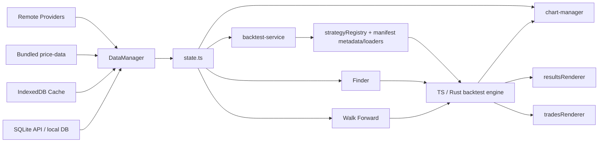

# Strategies Finder

Strategies Finder is a Vite + TypeScript trading research playground for building, testing, comparing, and validating strategy ideas on chart data.

It combines:
- a browser UI assembled from HTML partials at runtime
- a TypeScript backtest engine with optional Rust acceleration
- a multi-source data pipeline with local caching
- research tools such as Finder, Exit Strategy Override, Walk Forward, Monte Carlo, Scanner, Data Mining, Rank Pairs, Selection Rules, the Opportunity Explorer, and Batch Backtest
- optional Cloudflare Worker alerting and subscription execution

## What You Can Do Here
- Load market data from local SQLite, IndexedDB, bundled price files, or remote providers
- Run backtests with realistic execution settings and risk controls
- Switch between fixed, percent, Kelly, volatility-targeted, risk-parity, martingale, and Optimal f sizing models from the settings panel
- Compare strategies, inspect trades, and review backtest result diagnostics, including entry and exit timing quality
- Search parameter spaces with Finder, including random and genetic modes, and rank current-chart grid/random runs by Entry Score or Exit Score
- Run Batch Backtest across symbol-pair lists and compare survivor candidates across symbols, intervals, and execution settings
- Validate robustness with walk-forward analysis and latest-OOS checks
- Run Batch Backtest post-analysis with OPEN_SCORE USD Replay (a research-only diagnostic; see [`docs/mine-timing-validation-findings.md`](docs/mine-timing-validation-findings.md) for the validation status of removed surfaces)
- Build live or scheduled alert subscriptions through the Worker API
- Use Quick View to inspect backtest stats, trades, and per-trade diagnostics

Trade timing quality scores are descriptive diagnostics. Exit Score is measured on each strategy's own trades; it is not an isolated exit-rule benchmark.

## Quick Start

### Requirements
- Node.js 20+ recommended
- npm
- Windows PowerShell works well in this repo

### Install and Run
```bash
npm install
npm run dev
```

Open the Vite URL shown in the terminal, usually `http://localhost:5173`.

### First Useful Smoke Check
1. Pick a symbol and timeframe.
2. Select a strategy from the dropdown.
3. Click `Run Backtest`.
4. Open `Trades`, `Results`, `Finder`, and `Walk Forward` to verify the feature panels loaded.
5. Open `Monte Carlo` after a backtest to inspect drawdown tails and ruin probability under reshuffled paths.

## Architecture Map

### Bootstrap and layout
- Entry: `index.ts`
- Bootstrap sequencer: `lib/app-bootstrap.ts`
- Runtime layout injection: `lib/layout-manager.ts`
- Runtime HTML source: `html-partials/*`
- Feature wiring: `lib/handlers/*`

### Data and runtime state
- Data manager: `lib/data-manager.ts`
- Data providers: `lib/dataProviders/*`
- Browser caches: `lib/candle-cache.ts`, IndexedDB paths
- Local SQLite API client: `lib/local-sqlite-api.ts`
- Versioned localStorage helper: `lib/persisted-json.ts`
- Shared runtime state: `lib/state.ts`
- State write surface: `lib/state-actions.ts`

### Strategy and backtest engine
- Strategy registry and loading: `strategyRegistry.ts`
- Built-in source of truth: `lib/strategies/lib/*`, with generated metadata/loaders/eager manifests under `lib/strategies/manifest*.ts`
- Browser built-in loading: summary metadata and per-key loaders from `lib/strategies/manifest-summary.ts` and `lib/strategies/manifest-loaders.ts`
- Worker/test eager built-in library: `lib/strategies/library.ts`
- Backtest orchestration/UI: `lib/backtest-service.ts`
- Backtest run feedback presenter: `lib/backtest-run-presenter.ts`
- TS engine: `lib/strategies/backtest/*`
- Rust engine client: `lib/rust-engine-client.ts`
- Optional Rust loopback service: `rust-engine/` (start with
  `set START_RUST_ENGINE=1 && run_playground.bat`)

### Chart and renderer layer
- Chart controller: `lib/chart-manager.ts`
- Results renderer: `lib/renderers/resultsRenderer.ts`
- Trades renderer: `lib/renderers/tradesRenderer.ts`
- Backtest analysis helpers: `lib/backtest-result-analysis.ts`

### Research tools
- Finder: `lib/finder-manager.ts`, `lib/finder/*` (server-side Symbol Universe in `lib/finder/server/*`; see [docs/finder-server-side.md](docs/finder-server-side.md))
- Walk Forward: `lib/walk-forward-service.ts`
- Monte Carlo: `lib/monte-carlo-service.ts`, `lib/strategies/monte-carlo/*`
- Scanner: `lib/scanner/*`
- Data Mining: `lib/data-mining-manager.ts`, `lib/data-mining-dom.ts`
- Batch Backtest: `lib/batch-backtest/batch-backtest-service.ts` (browser orchestration), `lib/batch-backtest/batch-backtest-vite-plugin.ts` (server execution; see [docs/batch-backtest-server-side.md](docs/batch-backtest-server-side.md))

### Alerts / Worker
- Worker: `workers/entry-signal-worker.ts`
- API client: `lib/alert-service.ts`
- Worker docs: `workers/README.md`

## Architecture Flow



## How It Boots
1. `index.ts` delegates startup to `lib/app-bootstrap.ts`.
2. The bootstrap registry injects the runtime HTML layout from `html-partials/*`.
3. Strategy metadata is loaded, with built-in strategy code loaded on demand; then the chart layer and feature managers are initialized in dependency order.
4. Saved settings are restored and applied back into UI state and feature state.
5. Initial market data is loaded, after which reactive state updates drive chart, backtest, and renderer refreshes.

## UI Structure

This app is heavily id-driven.

The important rule is:
- markup lives in `html-partials/*`
- binding happens in `lib/handlers/*`, feature managers, and renderers
- required structural ids are defined in feature-local `*-dom.ts` modules next to their handlers, renderers, or services
- the smoke test `tests/feature-dom-contracts.spec.ts` imports every feature-local contract directly and fails if a required id disappears from the partials

If you rename a UI id, update the partial, the feature DOM contract, and the consuming code together.

## Data Flow and Caching

`DataManager` currently prefers:
1. local SQLite cache via Vite `/api/sqlite/*`
2. IndexedDB cache
3. bundled `price-data/*`
4. remote fetch from provider

This ordering matters because Finder, Scanner, and repeated backtests depend on fast warm-cache reads.

### Server-Side Batch Backtest

The Batch Backtest tab runs its workload in the Vite dev-server (Node) process, so 1000+ IBKR 4H synthetic-pair runs stop OOM-ing the browser. The browser tab holds only rendered scalars and DOM rows; Node writes per-row analysis artifacts to temporary disk storage and loads linked pairs back per target during OPEN_SCORE USD Replay.

For large runs, start the dev server with extra heap:

```bash
NODE_OPTIONS=--max-old-space-size=16384 npm run dev
```

The same heap guidance applies to server-owned Finder runs. Finder Asset
Opportunity **Batch OOS Holdout** sweeps additionally run holdout iterations
in parallel across a bounded worker-thread pool sized from your cores and
RAM (~10 MB per symbol plus an estimated 64 MB signal-cache budget per worker
against 75% of system RAM, including the prepared closed-candle view reused
across holdouts).
`FINDER_ASSET_BATCH_WORKERS=1` forces the original sequential loop (rollback
lever); Rust-engine runs prefer at most 2 workers. Server-owned **Symbol
Universe** multi-strategy jobs parallelize the same way across selected
strategies (`FINDER_UNIVERSE_WORKERS=1` forces the sequential loop; Rust
preference caps the auto pool at 4). See
[docs/finder-server-side.md](docs/finder-server-side.md).

Reattach after a tab reload is automatic (2s poll). The last completed Batch output is restored from a compact local snapshot after reload, and Copy summary in server-side mode preserves B&H and OPEN_SCORE sections through scalar summary fields; see [docs/batch-backtest-server-side.md](docs/batch-backtest-server-side.md).

## Important Contracts

### Strategy registration is split
- UI and runtime loading use `strategyRegistry`
- Built-in source of truth is `lib/strategies/lib/*`, with generated metadata, loader, key, and eager manifest files under `lib/strategies/manifest*.ts`
- Browser UI listing uses `lib/strategies/manifest-summary.ts`; browser strategy execution loads code through `lib/strategies/manifest-loaders.ts`
- `lib/strategies/library.ts` uses the eager manifest and is what worker-side evaluation imports

If you add or rename a built-in strategy, run `npm run strategies:sync-manifest` or the strategy will not load consistently.

### Settings compatibility is real
- persisted JSON blobs now route through `lib/persisted-json.ts`, which supports schema/version envelopes while still reading legacy raw JSON payloads
- removed trade-filter settings may still appear in old saved payloads; ignore them instead of restoring behavior
- any new setting unsupported by Rust must be stripped in both:
  - `lib/backtest-service.ts`
  - `lib/finder-manager.ts`

### Time handling is broad
The code accepts unix seconds, unix milliseconds, ISO strings, and `BusinessDay` objects.

Reuse existing helpers instead of inventing new conversions:
- `timeKey`
- `timeToNumber`
- existing parse/normalize helpers in backtest and data utilities

### Execution realism matters
- percentage and ATR take-profit exits are capped at the configured target price once touched
- stop-loss exits can still fill worse at the bar open when price gaps through the stop
- `next_open` runs impose a 1-bar re-entry cooldown after a full `signal` exit, so same-bar re-entries are blocked and the earliest new entry is the next bar
- if you need tighter execution realism than OHLC can provide, validate with lower-timeframe or tick data

## Common Workflows

### Strategy authoring
Built-in strategy authoring has enough contract surface to deserve its own guide.

Use:
- [`docs/strategy-authoring.md`](docs/strategy-authoring.md) for the template, normalization rules, and common failure modes
- [`docs/cross-symbol.md`](docs/cross-symbol.md) for the cross-symbol runtime contract, support matrix, and change map
- [`docs/synthetic-pairs.md`](docs/synthetic-pairs.md) for generating synthetic pair data (e.g. BNBPAXG) for backtest and Finder research
- [`docs/backtest-endpoint.md`](docs/backtest-endpoint.md) for local HTTP backtest usage, payload examples, and parity rules
- [`AGENTS.md`](AGENTS.md) for the operational checklist and validation habits

Endpoint note:
- the HTTP backtest endpoint intentionally uses one fixed sizing profile only: `$1000` per trade with `0.1%` commission
- the UI `Preview Endpoint` and `Copy Endpoint` actions are the preferred parity path because they reuse the exact latest UI backtest snapshot, upload the matching dataset, include the resolved secondary dataset for cross-symbol runs,

The short version:
1. Create `lib/strategies/lib/<strategy-key>.ts`.
2. Export a valid `Strategy`.
3. Run `npm run strategies:sync-manifest`.
4. Keep `normalizeParams(...)` aligned with `execute(...)`.
5. Run `npm run typecheck` and confirm the strategy appears in the UI.
6. To remove built-in strategies from disk, use `Library Tools` in the Settings tab. It can delete the current strategy or a pasted bulk list of keys, names, or filenames, archives each file to `archive/strategy/*`, and re-syncs the generated manifest files under `lib/strategies/` automatically.

Dev note:
- `npm run dev` ignores `lib/strategies/**` changes by default so Finder work is not interrupted while you author or edit strategies.
- After strategy edits, run `npm run strategies:sync-manifest` if needed and do a manual browser refresh when you are ready to load the new code.
- Set `WATCH_STRATEGIES=1` before starting Vite if you want live reload for `lib/strategies/**` again.

For strategy-idea generation via [`archive/prompt.txt`](archive/prompt.txt), keep the allowed helper surface aligned with real exported strategy-layer utilities. Favor low-complexity price, bar-geometry, crossover, pivot, and timeframe-alignment helpers before heavier transforms, and keep prompt-specific quality filters inside the prompt file rather than expanding the repo-level README.

### Check local data
One CLI research tool operates on the synced IBKR `30m` CSV tree (`price-data/ibkr/csv/30m/`):
- `npm run data:preflight` scans that tree for deterministic data defects (add `-- --json` for machine-readable output). Implementation: `lib/market-data/data-integrity-scan.ts`.

It is a descriptive diagnostic, not a trade signal.

### Change UI safely
1. Add or update markup in `html-partials/*`.
2. Add the required id to the matching feature-local `*-dom.ts` contract if it is structural.
3. Wire the feature through its typed DOM contract.
4. Run typecheck and the DOM-contract smoke test.

### Work on alerts / subscriptions
- Read `workers/README.md`
- Keep `workers/entry-signal-worker.ts` aligned with `lib/alert-service.ts`
- Add a worker migration for schema changes

## Troubleshooting

### UI looks stale after Vite HMR
This app has singleton managers and runtime-injected partials. If a panel or shortcut behaves inconsistently after hot reload, do a full page refresh before assuming the code is wrong.

### Data looks stale or inconsistent
The app prefers warm caches. If fresh remote data is not appearing, check the local SQLite and IndexedDB paths first before debugging the provider code.

### Rust engine never connects
Check the engine status indicator and the Rust sanitization path. Unsupported settings must be stripped in both `lib/backtest-service.ts` and `lib/finder-manager.ts`.

### UI ids suddenly break
Run:
```bash
npm run typecheck
..\..\..\node_modules\.bin\esno tests\feature-dom-contracts.spec.ts
```

## Validation Commands

Run from this directory.

```bash
npm run typecheck
npm run typecheck:tests
npm run test
npm run test:e2e
```

`npm run test` uses a compact wrapper that discovers `tests/**/*.spec.ts`, excludes `tests/e2e.spec.ts`, prints one status line per spec, and writes full per-spec logs to `artifacts/test-logs/latest`. `artifacts/test-logs/latest/summary.json` contains the machine-readable summary for agent or tooling use.
`npm run verify` runs typecheck, staged test typecheck, and the compact test suite.

Useful variants:
```bash
npm run test:verbose
npm run test:json
npm run test -- --runInBand
npm run test -- --jobs=4
npm run test -- backtesting-engine
```

Useful extras:
```bash
..\..\..\node_modules\.bin\esno tests\feature-dom-contracts.spec.ts
```

## Specialized Project Docs

These are intentionally narrower than the repo itself:
- `docs/README.md`: maintained documentation index
- `AGENTS.md`: safe-change handbook for coding agents
- `docs/backtest-endpoint.md`: local backtest endpoint usage and request contract
- `docs/backtest-engines-typescript-rust.md`: TypeScript/Rust engine split, engine-selection rules, and wire contracts
- `docs/batch-backtest-server-side.md`: server-side Batch Backtest, artifact retention, OPEN_SCORE USD Replay, S&P 500 TOP_MEAN, and memory budget
- `docs/finder-server-side.md`: server-owned Finder Symbol Universe (one server job owns all strategies + OOS), heap budget, scalar-only wire contract, Stop scoped by run id, and tab-reload reattach via `/api/finder/status`
- `docs/trade-ledger.md`: Batch trade-ledger export (v3), replay checker, and anti-leakage contract
- `docs/trade-ledger-sweep.md`: server-owned Ledger Rule Sweep contracts
- `docs/trade-gate.md`: Trade Gate Batch certification workflow and records
- `docs/selection-rules.md`: pair-selection rule contract, diagnostics, and detailed selection view
- `docs/asset-opportunity-explorer.md`: descriptive heatmap over the Asset Opportunity holdout archive (routes, cell semantics, limits)
- `docs/rank-pairs.md`: Rank Pairs regime classification contract
- `docs/alpaca-ibkr-sync.md`: Alpaca-backed IBKR Data workflow, source guards, and aggregation
- `docs/cross-symbol.md`: cross-symbol strategy runtime and support matrix
- `docs/synthetic-pairs.md`: synthetic pair generation and supported surfaces
- `docs/path-dependent-exits.md`: path-dependent Risk Management exits
- `docs/strategy-authoring.md`: built-in strategy authoring guide
- `docs/mine-timing-validation-findings.md`: historical negative findings behind the removal of Mine/selection diagnostic surfaces
- `docs/pairlist-selection-research.md`: completed preregistered pool-selection research record (candidate failed its adoption rule)
- `workers/README.md`: Worker endpoints, cron behavior, D1 setup, Telegram
- `DEPLOY_TO_VERCEL.md`: deployment notes
