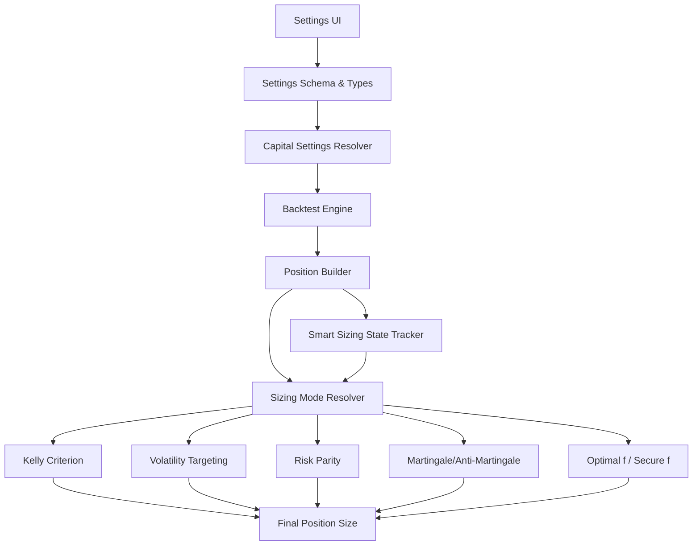

# Advanced Position Sizing Models - Implementation Plan

## Overview

This document outlines the phased implementation plan for adding advanced position sizing models to the Strategies-Finder playground. The current implementation supports:

- **Fixed $** - Fixed dollar amount per trade
- **Fixed %** - Percentage of capital per trade
- **Smart Fixed Velocity Memory** - Adjusts size based on recent trade velocity
- **Smart Fixed Quality x Velocity** - Combines entry quality scoring with velocity

The following models will be added:

1. **Kelly Criterion** - Full/half/quarter Kelly with fractional caps
2. **Volatility Targeting** - Size positions to achieve constant portfolio volatility
3. **Risk Parity Sizing** - Equal risk contribution across positions
4. **Martingale/Anti-Martingale** - Configurable recovery/de-risking sequences
5. **Optimal f / Secure f** - Ralph Vince's position sizing formulas

---

## Architecture Map



---

## Phase 1: Foundation - Type Contracts & Settings Schema

### Objective
Extend the type system and settings schema to support the new sizing modes.

### Changes Required

#### 1.1 Update `lib/types/backtest.ts`

Add new sizing mode constants and type guards:

```typescript
export const TRADE_SIZING_MODES = [
    'percent',
    'fixed',
    'smart_fixed_velocity_memory',
    'smart_fixed_quality_x_velocity',
    // New modes
    'kelly_criterion',
    'volatility_targeting',
    'risk_parity',
    'martingale',
    'anti_martingale',
    'optimal_f',
    'secure_f',
] as const;
```

Add new settings interface for advanced sizing parameters:

```typescript
export interface AdvancedSizingSettings {
    // Kelly Criterion
    kellyFraction?: 'full' | 'half' | 'quarter';
    kellyWinRateCap?: number;      // Max win rate to trust (0-1)
    kellyProfitFactorCap?: number; // Min PF to trust
    
    // Volatility Targeting
    volTargetAnnual?: number;      // Target annual volatility (e.g., 0.15 for 15%)
    volLookbackBars?: number;      // Bars for rolling volatility calc
    volScalingMethod?: 'ewma' | 'sma' | 'expanding';
    
    // Risk Parity
    riskParityLookback?: number;   // Bars for risk calculation
    riskParityMethod?: 'var' | 'expected_shortfall' | 'historical_std';
    
    // Martingale/Anti-Martingale
    martingaleMultiplier?: number; // e.g., 2.0 for double, 1.5 for half-step
    martingaleMaxSequence?: number; // Max consecutive steps
    martingaleResetOnWin?: boolean;
    martingaleResetOnLoss?: boolean;
    martingaleBaseSize?: 'fixed' | 'percent';
    
    // Optimal f / Secure f
    optimalFLookback?: number;     // Trades for f* calculation
    optimalFBootstrapSamples?: number;
    secureFConfidence?: number;    // e.g., 0.95 for 95% confidence
    secureFMethod?: 'bootstrap' | 'analytical';
}
```

Update `CapitalSettings`:

```typescript
export interface CapitalSettings {
    initialCapital: number;
    positionSize: number;
    commission: number;
    sizingMode: TradeSizingMode;
    fixedTradeAmount: number;
    advancedSizing?: AdvancedSizingSettings; // New
}
```

#### 1.2 Update `lib/settings-model.ts`

Add default values for advanced sizing settings:

```typescript
export const ADVANCED_SIZING_DEFAULTS = Object.freeze({
    // Kelly
    kellyFraction: 'half' as const,
    kellyWinRateCap: 0.7,
    kellyProfitFactorCap: 1.2,
    
    // Volatility Targeting
    volTargetAnnual: 0.15,
    volLookbackBars: 60,
    volScalingMethod: 'ewma' as const,
    
    // Risk Parity
    riskParityLookback: 100,
    riskParityMethod: 'historical_std' as const,
    
    // Martingale/Anti-Martingale
    martingaleMultiplier: 2.0,
    martingaleMaxSequence: 4,
    martingaleResetOnWin: true,
    martingaleResetOnLoss: false,
    martingaleBaseSize: 'fixed' as const,
    
    // Optimal f / Secure f
    optimalFLookback: 100,
    optimalFBootstrapSamples: 1000,
    secureFConfidence: 0.95,
    secureFMethod: 'bootstrap' as const,
});
```

#### 1.3 Update `lib/backtest-settings-dom-contract.ts`

Add DOM contracts for new settings fields. Define DOM IDs in a new `lib/advanced-sizing-dom.ts` module:

```typescript
// lib/advanced-sizing-dom.ts
export const KELLY_DOM_IDS = {
    kellyFraction: 'kellyFraction',
    kellyWinRateCap: 'kellyWinRateCap',
    kellyProfitFactorCap: 'kellyProfitFactorCap',
} as const;

export const VOL_TARGETING_DOM_IDS = {
    volTargetAnnual: 'volTargetAnnual',
    volLookbackBars: 'volLookbackBars',
    volScalingMethod: 'volScalingMethod',
} as const;

// ... etc for each sizing model
```

---

## Phase 2: Kelly Criterion Implementation

### Concept

The Kelly Criterion determines the optimal fraction of capital to allocate based on the probability of winning and the win/loss payoff ratio:

```
f* = p - q/b

Where:
- f* = fraction of capital to bet
- p = probability of winning
- q = probability of losing (1 - p)
- b = ratio of average win / average loss
```

### Implementation Structure

Create `lib/strategies/sizing/kelly-criterion.ts`:

```typescript
export interface KellySizingState {
    winCount: number;
    lossCount: number;
    totalWinAmount: number;
    totalLossAmount: number;
    lookbackTrades: number;
    tradeHistory: Array<{ pnl: number; isWin: boolean }>;
}

export interface KellyResult {
    kellyFraction: number;    // Raw Kelly f*
    cappedFraction: number;   // After applying caps
    appliedFraction: number;  // After user's fractional bet (full/half/quarter)
    isValid: boolean;         // Whether Kelly is trustworthy
    winRate: number;
    profitFactor: number;
}

export function calculateKelly(
    state: KellySizingState,
    settings: KellySettings
): KellyResult;

export function updateKellyState(
    state: KellySizingState,
    tradeResult: { pnl: number },
    maxLookback: number
): KellySizingState;
```

### Key Design Decisions

1. **Fractional Kelly**: User selects full/half/quarter, which multiplies the raw Kelly fraction
2. **Trust Caps**: Kelly is only trusted if:
   - Win rate is above `kellyWinRateCap` (e.g., > 70% is suspicious, cap it)
   - Profit factor is above `kellyProfitFactorCap` (e.g., > 1.2)
3. **Position Limits**: Kelly fraction is clamped to a reasonable range (e.g., 0.01 to 0.25)
4. **Trade History**: Rolling window of recent trades for adaptive Kelly

### Integration Point

In `position-builder.ts`, add a new case to `resolveSizingMultiplier`:

```typescript
case 'kelly_criterion':
    return resolveKellyMultiplier(
        smartSizingState?.kellyState,
        settings.advancedSizing?.kelly
    );
```

---

## Phase 3: Volatility Targeting

### Concept

Volatility targeting adjusts position sizes to maintain a constant target portfolio volatility. When market volatility is high, positions are sized smaller; when low, positions are sized larger.

```
Position Size = Base Size × (Target Vol / Current Vol)
```

### Implementation Structure

Create `lib/strategies/sizing/volatility-targeting.ts`:

```typescript
export interface VolTargetingState {
    returnsSeries: number[];      // Rolling returns
    currentVolAnnualized: number;  // Latest vol estimate
}

export interface VolTargetingSettings {
    targetAnnualVol: number;       // e.g., 0.15 for 15%
    lookbackBars: number;          // e.g., 60
    scalingMethod: 'ewma' | 'sma' | 'expanding';
    ewmaDecay?: number;            // For EWMA, e.g., 0.94
    maxVolScaling?: number;        // Cap on vol multiplier, e.g., 2.0
    minVolScaling?: number;        // Floor on vol multiplier, e.g., 0.5
}

export function calculateVolatility(
    returns: number[],
    method: 'ewma' | 'sma' | 'expanding',
    lookback: number,
    decay?: number
): number;

export function resolveVolTargetingMultiplier(
    state: VolTargetingState,
    settings: VolTargetingSettings
): number;
```

### Volatility Calculation Methods

1. **SMA (Simple Moving Average)**: Standard deviation of last N returns
2. **EWMA (Exponentially Weighted)**: More weight on recent returns
   ```
   σ²_t = λ × σ²_{t-1} + (1-λ) × r²_{t-1}
   ```
3. **Expanding**: All available historical returns

### Integration Point

The vol targeting multiplier scales the base allocation:

```typescript
// In position-builder.ts or dedicated resolver
const volMultiplier = resolveVolTargetingMultiplier(volState, volSettings);
// For percent sizing: effectivePercent = basePercent × volMultiplier
// For fixed $: effectiveFixed = baseFixed × volMultiplier
```

### Data Requirements

- Need access to price series for return calculation
- For portfolio-level vol targeting (future): need correlation matrix

---

## Phase 4: Risk Parity Sizing

### Concept

Risk parity allocates capital such that each position contributes equally to portfolio risk. This is more sophisticated than equal-weight sizing because it accounts for different volatilities and correlations.

**Note**: True risk parity requires a portfolio context. For single-symbol backtesting, this will be approximated as "volatility-scaled equal risk" per position.

### Implementation Structure

Create `lib/strategies/sizing/risk-parity.ts`:

```typescript
export interface RiskParitySettings {
    lookbackBars: number;
    riskMethod: 'var' | 'expected_shortfall' | 'historical_std';
    confidenceLevel?: number;    // For VaR/ES, e.g., 0.95
    targetRiskContribution?: number; // Per-position risk budget
}

export interface RiskParityState {
    assetVolatilities: Map<string, number>; // Symbol -> vol
    assetCorrelations?: number[][];          // If multi-asset
}

export function calculateRiskContribution(
    positions: PositionState[],
    volatilities: number[],
    correlationMatrix?: number[][]
): number[];

export function resolveRiskParityAllocation(
    state: RiskParityState,
    settings: RiskParitySettings,
    totalCapital: number
): Map<string, number>; // Symbol -> allocation
```

### Approximation for Single-Symbol

For the current single-symbol context, risk parity simplifies to:

```
Position Size = Total Capital / (N positions × Asset Vol)
```

Where N is effectively 1 for single-position backtests, making it similar to vol targeting.

### Future Multi-Asset Extension

When the platform supports true multi-asset portfolios:

1. Build covariance matrix from asset returns
2. Solve for risk contributions: `Σ × w = λ × 1` (equal risk)
3. Iterate to find weights where each asset contributes equal risk

---

## Phase 5: Martingale/Anti-Martingale

### Concept

- **Martingale**: Double (or increase) position size after losses to recover
- **Anti-Martingale**: Increase position size after wins (let winners run)

### Implementation Structure

Create `lib/strategies/sizing/martingale.ts`:

```typescript
export interface MartingaleState {
    currentSequence: number;      // Current step in sequence (0 = base)
    consecutiveLosses: number;
    consecutiveWins: number;
    baseSize: number;             // Reset point size
}

export interface MartingaleSettings {
    multiplier: number;           // e.g., 2.0 for classic martingale
    maxSequence: number;          // Cap on sequence length
    resetOnWin: boolean;
    resetOnLoss: boolean;
    baseSizeMode: 'fixed' | 'percent';
    baseSizeAmount?: number;      // If fixed
    baseSizePercent?: number;     // If percent
    antiMartingale: boolean;      // True = increase on wins, False = increase on losses
}

export function resolveMartingaleMultiplier(
    state: MartingaleState,
    settings: MartingaleSettings
): number;

export function updateMartingaleState(
    state: MartingaleState,
    tradeResult: { pnl: number; isWin: boolean },
    settings: MartingaleSettings
): MartingaleState;
```

### Behavior Examples

**Classic Martingale** (multiplier=2, resetOnWin=true):
```
Loss → Size ×2
Loss → Size ×4
Loss → Size ×8
Win  → Reset to base size
```

**Anti-Martingale** (antiMartingale=true, multiplier=1.5):
```
Win  → Size ×1.5
Win  → Size ×2.25
Loss → Reset to base size
```

### Safety Mechanisms

1. **Max Sequence**: Prevents infinite doubling (e.g., max 4-5 steps)
2. **Bankroll Cap**: Never allocate more than X% of capital
3. **Reset Conditions**: Configurable reset on win/loss

---

## Phase 6: Optimal f / Secure f

### Concept

Ralph Vince's **Optimal f** finds the fraction f that maximizes the geometric growth rate of capital based on historical trades. **Secure f** applies a confidence discount to account for estimation uncertainty.

### Optimal f Formula

Find f that maximizes:

```
TWR(f) = Π(1 + f × (-trade_i / max_loss))

Where:
- TWR = Terminal Wealth Relative
- trade_i = P&L of each historical trade (negative for losses)
- max_loss = largest losing trade (used for normalization)
```

### Secure f Approach

Apply a discount based on confidence level:

```
Secure f = Optimal f × (1 - confidenceAdjustment)

Where confidenceAdjustment increases with:
- Fewer historical trades
- Higher variance in trade outcomes
- Lower confidence level selection
```

### Implementation Structure

Create `lib/strategies/sizing/optimal-f.ts`:

```typescript
export interface OptimalFState {
    tradeHistory: number[];       // P&L values
    maxLoss: number;              // Largest historical loss
    calculatedOptimalF: number | null;
    calculatedSecureF: number | null;
}

export interface OptimalFSettings {
    lookbackTrades: number;
    bootstrapSamples: number;
    confidenceLevel: number;      // e.g., 0.95
    method: 'bootstrap' | 'analytical';
    fFloor?: number;              // Minimum f to use
    fCap?: number;                // Maximum f to use
}

export function calculateOptimalF(
    tradeHistory: number[],
    maxLoss: number
): number;

export function calculateSecureF(
    tradeHistory: number[],
    maxLoss: number,
    settings: OptimalFSettings
): { optimalF: number; secureF: number; confidence: number };

export function bootstrapSecureF(
    tradeHistory: number[],
    samples: number,
    confidenceLevel: number
): number;
```

### Optimization Approach

Optimal f is found via numerical optimization (e.g., Brent's method or grid search):

```typescript
function findOptimalF(trades: number[], maxLoss: number): number {
    // Search f in range [0, 1]
    // Maximize geometric mean of HPRs
    let bestF = 0;
    let bestGrowth = 0;
    for (let f = 0.01; f <= 1.0; f += 0.01) {
        const growth = calculateGeometricGrowth(f, trades, maxLoss);
        if (growth > bestGrowth) {
            bestGrowth = growth;
            bestF = f;
        }
    }
    return bestF;
}
```

---

## Phase 7: UI Integration

### HTML Changes

Update `html-partials/tab-settings-section-core.html` to add collapsible sections for each sizing model's settings.

Add a new settings panel that appears when an advanced sizing mode is selected:

```html
<div class="param-row" id="advancedSizingSettingsPanel" style="display: none;">
    <!-- Kelly Criterion Settings -->
    <div class="sizing-subsection" id="kellySettings" style="display: none;">
        <label>Kelly Fraction</label>
        <select id="kellyFraction">
            <option value="full">Full Kelly</option>
            <option value="half" selected>Half Kelly</option>
            <option value="quarter">Quarter Kelly</option>
        </select>
        <label>Win Rate Trust Cap</label>
        <input type="number" id="kellyWinRateCap" value="0.7" min="0.5" max="1" step="0.05">
        <label>Profit Factor Trust Cap</label>
        <input type="number" id="kellyProfitFactorCap" value="1.2" min="1" step="0.1">
    </div>
    
    <!-- Volatility Targeting Settings -->
    <div class="sizing-subsection" id="volTargetingSettings" style="display: none;">
        <label>Target Annual Volatility (%)</label>
        <input type="number" id="volTargetAnnual" value="15" min="1" max="100" step="1">
        <label>Volatility Lookback (bars)</label>
        <input type="number" id="volLookbackBars" value="60" min="10" step="5">
        <label>Scaling Method</label>
        <select id="volScalingMethod">
            <option value="ewma" selected>EWMA</option>
            <option value="sma">SMA</option>
            <option value="expanding">Expanding</option>
        </select>
    </div>
    
    <!-- ... similar sections for other sizing modes ... -->
</div>
```

### JavaScript Changes

Update `lib/handlers/ui-event-handlers.ts`:

```typescript
const sizingModeSelect = document.getElementById('tradeSizingMode');
const advancedSizingPanel = document.getElementById('advancedSizingSettingsPanel');
const sizingSubsections = {
    kelly_criterion: document.getElementById('kellySettings'),
    volatility_targeting: document.getElementById('volTargetingSettings'),
    risk_parity: document.getElementById('riskParitySettings'),
    martingale: document.getElementById('martingaleSettings'),
    anti_martingale: document.getElementById('antiMartingaleSettings'),
    optimal_f: document.getElementById('optimalFSettings'),
    secure_f: document.getElementById('secureFSettings'),
};

sizingModeSelect?.addEventListener('change', (e) => {
    const mode = (e.target as HTMLSelectElement).value;
    advancedSizingPanel.style.display = sizingSubsections[mode] ? 'block' : 'none';
    
    // Hide all subsections, show only relevant one
    Object.values(sizingSubsections).forEach(el => {
        if (el) el.style.display = 'none';
    });
    if (sizingSubsections[mode]) {
        sizingSubsections[mode].style.display = 'block';
    }
});
```

---

## Phase 8: State Management

### Smart Sizing State Extension

Update `SmartSizingState` in `lib/strategies/backtest/position-builder.ts`:

```typescript
export interface SmartSizingState {
    recentVelocityScores: number[];
    
    // Kelly Criterion
    kellyState?: KellySizingState;
    
    // Volatility Targeting
    volTargetingState?: VolTargetingState;
    
    // Martingale/Anti-Martingale
    martingaleState?: MartingaleState;
    
    // Optimal f / Secure f
    optimalFState?: OptimalFState;
}
```

### State Update Integration

In `lib/strategies/backtest/backtest-engine.ts`, after each position closes, update the relevant state:

```typescript
function updateSmartSizingState(
    state: SmartSizingState,
    closedPosition: PositionState,
    settings: NormalizedSettings
): SmartSizingState {
    const pnl = closedPosition.realizedPnl;
    const isWin = pnl > 0;
    
    // Update Kelly state
    if (state.kellyState && settings.sizingMode === 'kelly_criterion') {
        state.kellyState = updateKellyState(state.kellyState, { pnl, isWin });
    }
    
    // Update Martingale state
    if (state.martingaleState && 
        (settings.sizingMode === 'martingale' || settings.sizingMode === 'anti_martingale')) {
        state.martingaleState = updateMartingaleState(
            state.martingaleState,
            { pnl, isWin },
            settings.advancedSizing?.martingale
        );
    }
    
    // Update Optimal f state
    if (state.optimalFState && 
        (settings.sizingMode === 'optimal_f' || settings.sizingMode === 'secure_f')) {
        state.optimalFState = updateOptimalFState(
            state.optimalFState,
            pnl,
            settings.advancedSizing?.optimalF
        );
    }
    
    // Update volatility state (runs every bar, not just on trade close)
    // This is handled in the main bar loop
    
    return state;
}
```

---

## Phase 9: Backtest Engine Integration

### Position Builder Integration

In `lib/strategies/backtest/position-builder.ts`, extend `resolveSizingMultiplier`:

```typescript
function resolveSizingMultiplier(
    sizingMode: TradeSizingMode,
    smartSizingState: SmartSizingState | undefined,
    data: OHLCVData[],
    sizingBarIndex: number,
    direction: 'long' | 'short',
    triggerPrice: number | null,
    atrValue: number | null,
    advancedSettings?: AdvancedSizingSettings
): number {
    switch (sizingMode) {
        case 'smart_fixed_velocity_memory':
            return resolveVelocityMemoryMultiplier(smartSizingState);
        case 'smart_fixed_quality_x_velocity':
            return resolveQualityVelocityMultiplier(
                smartSizingState, data, sizingBarIndex, direction, atrValue
            );
        
        // New modes
        case 'kelly_criterion':
            return resolveKellyMultiplier(
                smartSizingState?.kellyState,
                advancedSettings?.kelly
            );
        
        case 'volatility_targeting':
            return resolveVolTargetingMultiplier(
                smartSizingState?.volTargetingState,
                advancedSettings?.volTargeting
            );
        
        case 'risk_parity':
            return resolveRiskParityMultiplier(
                smartSizingState?.riskParityState,
                advancedSettings?.riskParity
            );
        
        case 'martingale':
        case 'anti_martingale':
            return resolveMartingaleMultiplier(
                smartSizingState?.martingaleState,
                advancedSettings?.martingale
            );
        
        case 'optimal_f':
        case 'secure_f':
            return resolveOptimalFMultiplier(
                smartSizingState?.optimalFState,
                advancedSettings?.optimalF
            );
        
        default:
            return 1;
    }
}
```

### Capital Allocation Flow

For modes that directly specify allocation (Kelly, Optimal f), modify `resolveAllocatedCapital`:

```typescript
function resolveAllocatedCapital(
    sizingMode: TradeSizingMode,
    capital: number,
    positionSizePercent: number,
    fixedTradeAmount: number,
    // ... other params
    advancedSettings?: AdvancedSizingSettings
): number {
    // Direct allocation modes (override base allocation)
    if (sizingMode === 'kelly_criterion') {
        const kellyResult = calculateKellyAllocation(
            smartSizingState?.kellyState,
            advancedSettings?.kelly,
            capital
        );
        return kellyResult.allocation;
    }
    
    if (sizingMode === 'optimal_f' || sizingMode === 'secure_f') {
        const fResult = calculateOptimalFAllocation(
            smartSizingState?.optimalFState,
            advancedSettings?.optimalF,
            capital
        );
        return fResult.allocation;
    }
    
    // Multiplier-based modes (scale base allocation)
    const baseAllocation = usesFixedDollarSizing(sizingMode) && fixedTradeAmount > 0
        ? fixedTradeAmount
        : capital * (positionSizePercent / 100);
    
    if (!isSmartTradeSizingMode(sizingMode) || baseAllocation <= 0) {
        return baseAllocation;
    }
    
    const multiplier = resolveSizingMultiplier(/* ... */);
    return baseAllocation * multiplier;
}
```

---

## Phase 10: Rust Compatibility Layer

### Sanitization

Update `lib/rust-settings-sanitizer.ts` to strip advanced sizing settings for Rust engine:

```typescript
export const RUST_UNSUPPORTED_SIZING_MODES = [
    'kelly_criterion',
    'volatility_targeting',
    'risk_parity',
    'martingale',
    'anti_martingale',
    'optimal_f',
    'secure_f',
] as const;

export function sanitizeBacktestSettingsForRust(
    settings: BacktestSettings
): BacktestSettings {
    const sanitized = { ...settings };
    
    if (RUST_UNSUPPORTED_SIZING_MODES.includes(sanitized.sizingMode as any)) {
        sanitized.sizingMode = 'percent'; // Fallback
    }
    
    // Strip advanced sizing settings
    if ('advancedSizing' in sanitized) {
        delete sanitized.advancedSizing;
    }
    
    return sanitized;
}
```

### Warning Log

In `lib/rust-engine-client.ts`, add warnings for unsupported sizing modes:

```typescript
if (sizing && RUST_UNSUPPORTED_SIZING_MODES.includes(sizing.mode as any)) {
    rustLog.warn(`[RustEngine] ${sizing.mode} is not supported, using TypeScript fallback`);
    return null; // Trigger TypeScript fallback
}
```

---

## Phase 11: Finder / Walk Forward Integration

### Finder Compatibility

The Finder optimization loop needs to handle advanced sizing settings. Update `lib/finder/finder-param-space.ts`:

```typescript
export const SIZING_PARAM_SPACE = {
    kelly_criterion: {
        kellyFraction: ['full', 'half', 'quarter'],
        kellyWinRateCap: [0.5, 0.6, 0.7, 0.8],
        kellyProfitFactorCap: [1.0, 1.2, 1.5],
    },
    volatility_targeting: {
        volTargetAnnual: [0.10, 0.15, 0.20, 0.25],
        volLookbackBars: [30, 60, 90, 120],
    },
    // ... etc
};
```

### Walk Forward Compatibility

For Walk Forward analysis, advanced sizing settings should be:
1. **Fixed** - Use the same settings across all windows
2. **Optimized** - Include in the parameter optimization

Add a toggle in the Walk Forward UI to choose between these modes.

### Performance Considerations

Some sizing models (especially Optimal f with bootstrap) are computationally expensive. For Finder/WFA:

1. **Cache** calculations where possible
2. **Precompute** rolling statistics
3. **Limit** bootstrap samples for Secure f in optimization loops
4. Consider **approximate** formulas for speed

---

## Phase 12: Testing

### Unit Tests

Create `tests/advanced-sizing.spec.ts`:

```typescript
describe('Kelly Criterion Sizing', () => {
    it('should calculate correct Kelly fraction for known win rate and payoff', () => {
        const state = {
            winCount: 60,
            lossCount: 40,
            totalWinAmount: 12000,
            totalLossAmount: 8000,
            lookbackTrades: 100,
            tradeHistory: [],
        };
        const settings = { kellyFraction: 'half' as const };
        const result = calculateKelly(state, settings);
        
        // p = 0.6, q = 0.4, b = 12000/8000 = 1.5
        // Kelly = 0.6 - 0.4/1.5 = 0.6 - 0.267 = 0.333
        // Half Kelly = 0.167
        expect(result.appliedFraction).to.be.closeTo(0.167, 0.01);
    });
    
    it('should cap Kelly when win rate is suspiciously high', () => {
        // Test trust caps
    });
});

describe('Volatility Targeting', () => {
    it('should increase size when current vol is below target', () => {
        // Target 15%, current 10% => multiplier should be 1.5
    });
    
    it('should decrease size when current vol exceeds target', () => {
        // Target 15%, current 30% => multiplier should be 0.5
    });
});

describe('Martingale/Anti-Martingale', () => {
    it('should double size after each loss (martingale)', () => {
        // Test sequence progression
    });
    
    it('should reset to base size on win (martingale)', () => {
        // Test reset behavior
    });
    
    it('should respect max sequence limit', () => {
        // Test cap
    });
});

describe('Optimal f', () => {
    it('should find optimal f for simple trade sequence', () => {
        // Test with known optimal f
    });
    
    it('should apply confidence discount for secure f', () => {
        // Test secure f < optimal f
    });
});
```

### Integration Tests

In `tests/backtesting-engine.spec.ts`, add tests for each sizing mode:

```typescript
it('kelly_criterion should size based on win rate and payoff ratio', () => {
    // Create trade sequence with known statistics
    // Run backtest with kelly_criterion
    // Verify position sizes match expected Kelly allocation
});

it('volatility_targeting should maintain target volatility', () => {
    // Create price series with varying volatility
    // Run backtest with vol_targeting
    // Verify realized volatility is close to target
});
```

---

## File Creation Summary

| File | Purpose |
|------|---------|
| `lib/types/backtest.ts` | Extended type definitions |
| `lib/advanced-sizing-dom.ts` | DOM ID contracts |
| `lib/strategies/sizing/kelly-criterion.ts` | Kelly implementation |
| `lib/strategies/sizing/volatility-targeting.ts` | Vol targeting implementation |
| `lib/strategies/sizing/risk-parity.ts` | Risk parity implementation |
| `lib/strategies/sizing/martingale.ts` | Martingale implementation |
| `lib/strategies/sizing/optimal-f.ts` | Optimal f implementation |
| `tests/advanced-sizing.spec.ts` | Unit tests |

## File Modification Summary

| File | Changes |
|------|---------|
| `lib/types/backtest.ts` | Add sizing modes, AdvancedSizingSettings |
| `lib/settings-model.ts` | Add defaults, parsers |
| `lib/backtest-settings-dom-contract.ts` | Add DOM contracts |
| `lib/backtest-settings-resolver.ts` | Add resolvers |
| `html-partials/tab-settings-section-core.html` | Add UI controls |
| `lib/handlers/ui-event-handlers.ts` | Add event handlers |
| `lib/strategies/backtest/position-builder.ts` | Add sizing resolvers |
| `lib/strategies/backtest/backtest-engine.ts` | Add state updates |
| `lib/rust-settings-sanitizer.ts` | Add sanitization |
| `lib/rust-engine-client.ts` | Add warnings |
| `lib/finder/finder-param-space.ts` | Add param spaces |

---

## Risk Assessment

| Risk | Mitigation |
|------|------------|
| Computational cost (Optimal f bootstrap) | Limit samples, cache results, use approximate formulas |
| Overfitting (Kelly, Optimal f) | Apply trust caps, use fractional Kelly, secure f |
| Rust incompatibility | TypeScript fallback, clear warnings |
| Finder/WFA performance | Precompute rolling stats, limit optimization params |
| UI complexity | Collapsible sections, progressive disclosure |

---

## Success Criteria

1. All new sizing modes appear in the dropdown
2. Each mode has dedicated settings panel
3. Backtest results reflect correct sizing behavior
4. Finder and Walk Forward can optimize advanced sizing params
5. Rust engine gracefully falls back to TypeScript
6. Unit tests pass for all sizing models
7. Documentation updated with usage examples
