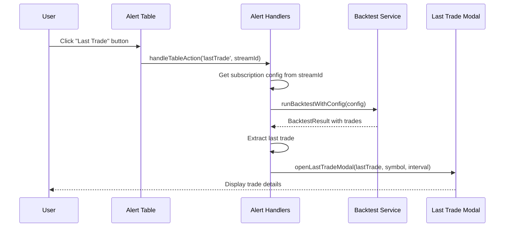

# Implementation Plan: Last Trade Button for Alert List

## Overview
Add a "Last Trade" button to each alert subscription row in the Alerts tab. When clicked, it will:
1. Run a backtest using the subscription's configuration (strategy params + backtest settings)
2. Display the last trade from that backtest in a modal with full details

## Files to Modify

### 1. `html-partials/tab-alerts.html`
- Add "Last Trade" button to the Actions column in the subscription table
- Add a new modal for displaying last trade details

### 2. `lib/handlers/alert-handlers.ts`
- Add 'lastTrade' action type to `createActionButton()`
- Implement `handleLastTradeAction()` function to:
  - Extract subscription configuration (strategy params + backtest settings)
  - Run backtest with that configuration
  - Extract last trade from results
  - Display in modal
- Add modal open/close handlers for last trade display

### 3. `lib/backtest-service.ts`
- Add public method `runBacktestWithConfig()` to run backtest with custom strategy params and settings

### 4. `styles/alerts.css` (or relevant CSS file)
- Add styling for the "Last Trade" button
- Add styling for the last trade modal content

## Implementation Details

### Button Placement
The "Last Trade" button will be added to the Actions column, after the existing buttons:
```
[Info] [Run] [Use Current] [Disable] [Last Trade]
```

### Modal Structure
```html
<div class="modal-overlay" id="lastTradeModal">
    <div class="modal last-trade-modal">
        <div class="modal-header">
            <span class="modal-title" id="lastTradeModalTitle">Last Trade</span>
            <button class="modal-close" id="lastTradeModalClose">
                <svg viewBox="0 0 24 24" fill="currentColor" width="16" height="16">
                    <path d="M18.3 5.71 12 12l6.3 6.29-1.41 1.41L10.59 13.4 4.29 19.7 2.88 18.29 9.17 12 2.88 5.71 4.29 4.3l6.3 6.3 6.29-6.3z" />
                </svg>
            </button>
        </div>
        <div class="modal-body" id="lastTradeModalBody">
            <!-- Trade details will be rendered here -->
        </div>
    </div>
</div>
```

### Trade Details to Display
- **Trade Type**: Long/Short
- **Entry**: Price and Date/Time
- **Exit**: Price and Date/Time (or "Open" if still active)
- **P&L**: Dollar amount and percentage
- **Duration**: Time held
- **Exit Reason**: TP, SL, Signal, Time Stop, EOD, etc.
- **Status**: Win/Loss

### Backtest Execution Flow
1. User clicks "Last Trade" button
2. Extract strategy params and backtest settings from subscription
3. Fetch data for the subscription's symbol and interval
4. Run backtest with extracted config
5. Get last trade from results (`result.trades[result.trades.length - 1]`)
6. Display in modal
7. Handle loading state during backtest execution

## Sequence Diagram


## Testing Checklist
- [ ] Button appears in Actions column for each subscription
- [ ] Clicking button shows loading state
- [ ] Backtest runs successfully with subscription config
- [ ] Last trade displays correctly in modal
- [ ] Modal can be closed with X button or clicking outside
- [ ] Keyboard navigation works (Escape to close)
- [ ] Error handling works when backtest fails

## Estimated Effort
- **HTML changes**: ~20 lines
- **TypeScript changes**: ~100-150 lines
- **CSS changes**: ~30 lines
- **Testing**: Manual verification

## Related Files Reference
- [`lib/handlers/alert-handlers.ts`](lib/handlers/alert-handlers.ts) - Main handler logic
- [`html-partials/tab-alerts.html`](html-partials/tab-alerts.html) - UI template
- [`lib/backtest-service.ts`](lib/backtest-service.ts) - Backtest execution
- [`lib/renderers/tradesRenderer.ts`](lib/renderers/tradesRenderer.ts) - Trade rendering reference
