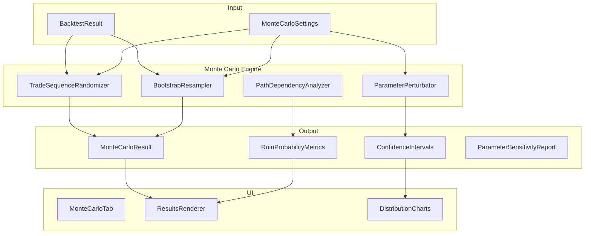

# Monte Carlo Simulation Implementation Plan

## Overview

This plan implements a comprehensive Monte Carlo simulation module for the trading strategy playground, providing statistical validation of backtest results through:
1. **Trade Sequence Randomization** - Shuffle trade order to estimate ruin probability
2. **Bootstrap Resampling** - Resample trades with replacement  
3. **Parameter Perturbation Analysis** - Test sensitivity to parameter changes
4. **Path Dependency Analysis** - Probability of hitting drawdown limits before profitability

## Architecture



## File Structure

```
lib/
├── strategies/
│   └── monte-carlo/
│       ├── index.ts                    # Main entry point
│       ├── types.ts                    # Type definitions
│       ├── trade-sequence-randomizer.ts # Shuffle trades
│       ├── bootstrap-resampler.ts      # Sample with replacement
│       ├── parameter-perturbation.ts   # Parameter sensitivity
│       ├── path-dependency-analyzer.ts # Ruin probability
│       └── monte-carlo-engine.ts       # Orchestrator
├── ui/
│   ├── monte-carlo-dom.ts              # DOM contracts
│   ├── monte-carlo-service.ts          # UI logic
│   └── monte-carlo-renderer.ts         # Results rendering
html-partials/
└── tab-monte-carlo.html                # UI template
```

---

## Step 1: Type Definitions

**File:** `lib/strategies/monte-carlo/types.ts`

```typescript
import type { BacktestResult, Trade, OHLCVData } from "../types";
import type { StrategyParams } from "../types";

// ============================================================================
// Configuration Types
// ============================================================================

export interface MonteCarloSettings {
    /** Number of simulation iterations */
    simulations: number;
    /** Random seed for reproducibility */
    seed: number;
    /** Enable trade sequence randomization */
    enableSequenceRandomization: boolean;
    /** Enable bootstrap resampling */
    enableBootstrap: boolean;
    /** Enable parameter perturbation */
    enableParameterPerturbation: boolean;
    /** Parameter perturbation std dev as % of param value */
    parameterPerturbationStdDev: number;
    /** Ruin threshold as % of initial capital */
    ruinThresholdPercent: number;
    /** Initial capital for simulation */
    initialCapital: number;
}

export interface ParameterPerturbationConfig {
    paramKey: string;
    baseValue: number;
    perturbationStdDev: number;
    minConstraint?: number;
    maxConstraint?: number;
}

// ============================================================================
// Result Types
// ============================================================================

export interface MonteCarloSimulation {
    simulationId: number;
    trades: Trade[];
    netProfit: number;
    netProfitPercent: number;
    maxDrawdown: number;
    maxDrawdownPercent: number;
    sharpeRatio: number;
    finalEquity: number;
    equityCurve: { time: number; value: number }[];
    ruinOccurred: boolean;
    timeToRuin?: number;
}

export interface RuinProbabilityMetrics {
    /** Probability of equity falling below threshold */
    ruinProbability: number;
    /** Expected number of trades until ruin */
    expectedTradesToRuin: number | null;
    /** Median trades to ruin (for ruined simulations) */
    medianTradesToRuin: number | null;
    /** Percentage of simulations that hit ruin */
    ruinRate: number;
    /** Distribution of maximum drawdowns */
    maxDrawdownDistribution: {
        mean: number;
        median: number;
        stdDev: number;
        percentile5: number;
        percentile25: number;
        percentile75: number;
        percentile95: number;
    };
}

export interface ConfidenceIntervals {
    netProfit: {
        observed: number;
        ci50Lower: number;
        ci50Upper: number;
        ci90Lower: number;
        ci90Upper: number;
        ci95Lower: number;
        ci95Upper: number;
    };
    maxDrawdown: {
        observed: number;
        ci50Lower: number;
        ci50Upper: number;
        ci90Lower: number;
        ci90Upper: number;
        ci95Lower: number;
        ci95Upper: number;
    };
    sharpeRatio: {
        observed: number;
        ci50Lower: number;
        ci50Upper: number;
        ci90Lower: number;
        ci90Upper: number;
        ci95Lower: number;
        ci95Upper: number;
    };
    winRate: {
        observed: number;
        ci50Lower: number;
        ci50Upper: number;
        ci90Lower: number;
        ci90Upper: number;
        ci95Lower: number;
        ci95Upper: number;
    };
}

export interface ParameterSensitivityReport {
    paramKey: string;
    baseValue: number;
    perturbations: {
        perturbedValue: number;
        netProfit: number;
        sharpeRatio: number;
        maxDrawdown: number;
        sensitivity: number; // d(Metric)/d(Param)
    }[];
    overallSensitivity: number;
    stabilityScore: number; // 0-100, higher = more stable
}

export interface MonteCarloResult {
    status: "success" | "error" | "insufficient_sample";
    errorMessage?: string;
    
    // Configuration used
    settings: MonteCarloSettings;
    simulationsCompleted: number;
    
    // Input summary
    inputTradeCount: number;
    inputNetProfit: number;
    inputSharpeRatio: number;
    
    // Simulation results
    simulations: MonteCarloSimulation[];
    
    // Aggregated metrics
    ruinProbabilityMetrics: RuinProbabilityMetrics;
    confidenceIntervals: ConfidenceIntervals;
    
    // Distribution statistics
    netProfitDistribution: {
        mean: number;
        median: number;
        stdDev: number;
        skewness: number;
        kurtosis: number;
        min: number;
        max: number;
    };
    
    // Parameter sensitivity (if enabled)
    parameterSensitivity?: ParameterSensitivityReport[];
    
    // Diagnostic info
    executionTimeMs: number;
    seed: number;
}

// ============================================================================
// Internal Types
// ============================================================================

export type TradeReturn = {
    pnlPercent: number;
    pnl: number;
    originalIndex: number;
};

export type EquityCurvePoint = {
    bar: number;
    equity: number;
    cumulativeReturn: number;
};
```

---

## Step 2: Trade Sequence Randomizer

**File:** `lib/strategies/monte-carlo/trade-sequence-randomizer.ts`

```typescript
import type { Trade } from "../types";
import type { TradeReturn } from "./types";
import { createSeededRandom } from "./utils";

/**
 * Randomizes the sequence of trades to test path dependency.
 * Keeps trade magnitudes fixed but shuffles their order.
 */
export function randomizeTradeSequence(
    trades: Trade[],
    seed: number
): Trade[] {
    const tradeReturns = trades.map((trade, index) => ({
        pnlPercent: trade.pnlPercent,
        pnl: trade.pnl,
        originalIndex: index,
        originalTrade: trade,
    }));
    
    const shuffled = fisherYatesShuffle(tradeReturns, seed);
    
    // Rebuild trades with shuffled order but new timestamps
    return shuffled.map((item, newIndex) => ({
        ...item.originalTrade,
        id: newIndex,
        entryTime: trades[newIndex]?.entryTime ?? item.originalTrade.entryTime,
        exitTime: trades[newIndex]?.exitTime ?? item.originalTrade.exitTime,
    }));
}

/**
 * Fisher-Yates shuffle with seeded random
 */
function fisherYatesShuffle<T>(array: T[], seed: number): T[] {
    const random = createSeededRandom(seed);
    const result = [...array];
    
    for (let i = result.length - 1; i > 0; i--) {
        const j = Math.floor(random() * (i + 1));
        [result[i], result[j]] = [result[j], result[i]];
    }
    
    return result;
}

/**
 * Generate multiple randomized sequences
 */
export function generateRandomizedSequences(
    trades: Trade[],
    seed: number,
    count: number
): Trade[][] {
    return Array.from({ length: count }, (_, i) => 
        randomizeTradeSequence(trades, seed + i)
    );
}
```

---

## Step 3: Bootstrap Resampler

**File:** `lib/strategies/monte-carlo/bootstrap-resampler.ts`

```typescript
import type { Trade } from "../types";
import { createSeededRandom } from "./utils";

/**
 * Bootstrap resampling - samples trades WITH replacement.
 * This creates new synthetic trade sequences of the same length.
 */
export function bootstrapResample(
    trades: Trade[],
    seed: number
): Trade[] {
    if (trades.length === 0) return [];
    
    const random = createSeededRandom(seed);
    const result: Trade[] = [];
    
    for (let i = 0; i < trades.length; i++) {
        const randomIndex = Math.floor(random() * trades.length);
        const originalTrade = trades[randomIndex];
        
        result.push({
            ...originalTrade,
            id: i,
            // Preserve original trade characteristics
        });
    }
    
    return result;
}

/**
 * Generate multiple bootstrap samples
 */
export function generateBootstrapSamples(
    trades: Trade[],
    seed: number,
    count: number
): Trade[][] {
    return Array.from({ length: count }, (_, i) => 
        bootstrapResample(trades, seed + i)
    );
}

/**
 * Block bootstrap - preserves autocorrelation structure
 * Samples blocks of consecutive trades instead of individual trades
 */
export function blockBootstrapResample(
    trades: Trade[],
    seed: number,
    blockSize: number = 4
): Trade[] {
    if (trades.length === 0) return [];
    
    const random = createSeededRandom(seed);
    const numBlocks = Math.ceil(trades.length / blockSize);
    const result: Trade[] = [];
    
    // Create blocks
    const blocks: Trade[][] = [];
    for (let i = 0; i < trades.length; i += blockSize) {
        blocks.push(trades.slice(i, i + blockSize));
    }
    
    // Sample blocks with replacement
    for (let i = 0; i < numBlocks && result.length < trades.length; i++) {
        const blockIndex = Math.floor(random() * blocks.length);
        const block = blocks[blockIndex];
        result.push(...block);
    }
    
    return result.slice(0, trades.length);
}
```

---

## Step 4: Parameter Perturbation Analysis

**File:** `lib/strategies/monte-carlo/parameter-perturbation.ts`

```typescript
import type { StrategyParams } from "../types";
import { createSeededRandom, gaussianRandom } from "./utils";

export interface PerturbedParams {
    original: StrategyParams;
    perturbed: StrategyParams;
    perturbationMagnitude: number;
}

/**
 * Perturbs strategy parameters using Gaussian noise
 */
export function perturbParameters(
    params: StrategyParams,
    seed: number,
    stdDevPercent: number = 5
): PerturbedParams {
    const random = createSeededRandom(seed);
    const perturbed: StrategyParams = {};
    let totalPerturbation = 0;
    let paramCount = 0;
    
    for (const [key, value] of Object.entries(params)) {
        if (typeof value !== "number" || !Number.isFinite(value)) {
            perturbed[key] = value;
            continue;
        }
        
        const noise = gaussianRandom(random) * (stdDevPercent / 100);
        const perturbedValue = value * (1 + noise);
        
        // Apply constraints (avoid zero or negative for params that should be positive)
        perturbed[key] = value > 0 ? Math.max(0.001, perturbedValue) : perturbedValue;
        
        totalPerturbation += Math.abs(noise);
        paramCount++;
    }
    
    return {
        original: params,
        perturbed,
        perturbationMagnitude: paramCount > 0 ? totalPerturbation / paramCount : 0,
    };
}

/**
 * Generate sensitivity report across multiple perturbations
 */
export interface SensitivityAnalysisResult {
    baseMetrics: {
        netProfit: number;
        sharpeRatio: number;
        maxDrawdown: number;
    };
    perturbedMetrics: Array<{
        perturbationMagnitude: number;
        netProfit: number;
        sharpeRatio: number;
        maxDrawdown: number;
    }>;
    sensitivities: {
        netProfit: number; // d(NetProfit)/d(Param)
        sharpeRatio: number;
        maxDrawdown: number;
    };
    stabilityScore: number; // 0-100
}

export function analyzeParameterSensitivity(
    params: StrategyParams,
    seed: number,
    stdDevPercent: number = 5,
    simulations: number = 30
): {
    perturbations: PerturbedParams[];
    averagePerturbationMagnitude: number;
} {
    const perturbations: PerturbedParams[] = [];
    let totalMagnitude = 0;
    
    for (let i = 0; i < simulations; i++) {
        const perturbation = perturbParameters(params, seed + i, stdDevPercent);
        perturbations.push(perturbation);
        totalMagnitude += perturbation.perturbationMagnitude;
    }
    
    return {
        perturbations,
        averagePerturbationMagnitude: totalMagnitude / simulations,
    };
}
```

---

## Step 5: Path Dependency Analyzer

**File:** `lib/strategies/monte-carlo/path-dependency-analyzer.ts`

```typescript
import type { Trade } from "../types";
import type { EquityCurvePoint, RuinProbabilityMetrics } from "./types";

/**
 * Builds equity curve from sequence of trades
 */
export function buildEquityCurve(
    trades: Trade[],
    initialCapital: number
): EquityCurvePoint[] {
    const curve: EquityCurvePoint[] = [];
    let equity = initialCapital;
    let cumulativeReturn = 0;
    
    for (let i = 0; i < trades.length; i++) {
        const trade = trades[i];
        equity += trade.pnl;
        cumulativeReturn = (equity - initialCapital) / initialCapital;
        
        curve.push({
            bar: i,
            equity,
            cumulativeReturn,
        });
    }
    
    return curve;
}

/**
 * Calculates maximum drawdown from equity curve
 */
export function calculateMaxDrawdown(equityCurve: EquityCurvePoint[]): {
    maxDrawdown: number;
    maxDrawdownPercent: number;
    drawdownStart: number;
    drawdownEnd: number;
} {
    let peak = equityCurve[0]?.equity ?? 0;
    let maxDrawdown = 0;
    let maxDrawdownPercent = 0;
    let drawdownStart = 0;
    let drawdownEnd = 0;
    let currentStart = 0;
    
    for (let i = 0; i < equityCurve.length; i++) {
        const point = equityCurve[i];
        
        if (point.equity > peak) {
            peak = point.equity;
            currentStart = i;
        }
        
        const drawdown = peak - point.equity;
        const drawdownPercent = peak > 0 ? drawdown / peak : 0;
        
        if (drawdown > maxDrawdown) {
            maxDrawdown = drawdown;
            maxDrawdownPercent = drawdownPercent;
            drawdownStart = currentStart;
            drawdownEnd = i;
        }
    }
    
    return { maxDrawdown, maxDrawdownPercent, drawdownStart, drawdownEnd };
}

/**
 * Checks if ruin occurred (equity fell below threshold)
 */
export function checkRuin(
    equityCurve: EquityCurvePoint[],
    ruinThreshold: number
): {
    ruinOccurred: boolean;
    timeToRuin?: number;
    minEquity: number;
} {
    let minEquity = Infinity;
    
    for (let i = 0; i < equityCurve.length; i++) {
        const point = equityCurve[i];
        if (point.equity < minEquity) {
            minEquity = point.equity;
        }
        if (point.equity < ruinThreshold) {
            return {
                ruinOccurred: true,
                timeToRuin: i,
                minEquity,
            };
        }
    }
    
    return {
        ruinOccurred: false,
        minEquity,
    };
}

/**
 * Computes comprehensive ruin probability metrics
 */
export function computeRuinProbabilityMetrics(
    simulations: Array<{
        equityCurve: EquityCurvePoint[];
        maxDrawdown: number;
        maxDrawdownPercent: number;
        ruinOccurred: boolean;
        timeToRuin?: number;
    }>,
    ruinThresholdPercent: number
): RuinProbabilityMetrics {
    const ruinCount = simulations.filter(s => s.ruinOccurred).length;
    const ruinRate = simulations.length > 0 ? ruinCount / simulations.length : 0;
    
    // Time to ruin for ruined simulations
    const timesToRuin = simulations
        .filter(s => s.ruinOccurred && s.timeToRuin !== undefined)
        .map(s => s.timeToRuin!);
    
    const expectedTradesToRuin = timesToRuin.length > 0
        ? timesToRuin.reduce((a, b) => a + b, 0) / timesToRuin.length
        : null;
    
    const medianTradesToRuin = timesToRuin.length > 0
        ? median(timesToRuin)
        : null;
    
    // Drawdown distribution
    const drawdowns = simulations.map(s => s.maxDrawdownPercent);
    const drawdownDistribution = {
        mean: mean(drawdowns),
        median: median(drawdowns),
        stdDev: stdDev(drawdowns),
        percentile5: percentile(drawdowns, 5),
        percentile25: percentile(drawdowns, 25),
        percentile75: percentile(drawdowns, 75),
        percentile95: percentile(drawdowns, 95),
    };
    
    return {
        ruinProbability: ruinRate,
        expectedTradesToRuin,
        medianTradesToRuin,
        ruinRate,
        maxDrawdownDistribution: drawdownDistribution,
    };
}

// Helper functions
function mean(values: number[]): number {
    if (values.length === 0) return 0;
    return values.reduce((sum, v) => sum + v, 0) / values.length;
}

function median(values: number[]): number {
    if (values.length === 0) return 0;
    const sorted = [...values].sort((a, b) => a - b);
    const mid = Math.floor(sorted.length / 2);
    return sorted.length % 2 === 1 ? sorted[mid] : (sorted[mid - 1] + sorted[mid]) / 2;
}

function stdDev(values: number[]): number {
    if (values.length < 2) return 0;
    const avg = mean(values);
    const variance = values.reduce((sum, v) => sum + Math.pow(v - avg, 2), 0) / (values.length - 1);
    return Math.sqrt(variance);
}

function percentile(values: number[], p: number): number {
    if (values.length === 0) return 0;
    const sorted = [...values].sort((a, b) => a - b);
    const index = (p / 100) * (sorted.length - 1);
    const lower = Math.floor(index);
    const upper = Math.ceil(index);
    if (lower === upper) return sorted[lower];
    return sorted[lower] * (upper - index) + sorted[upper] * (index - lower);
}
```

---

## Step 6: Monte Carlo Engine (Orchestrator)

**File:** `lib/strategies/monte-carlo/monte-carlo-engine.ts`

```typescript
import type { BacktestResult, Trade, StrategyParams, OHLCVData } from "../types";
import type { MonteCarloSettings, MonteCarloResult, MonteCarloSimulation } from "./types";
import { randomizeTradeSequence, generateRandomizedSequences } from "./trade-sequence-randomizer";
import { bootstrapResample, generateBootstrapSamples } from "./bootstrap-resampler";
import { buildEquityCurve, calculateMaxDrawdown, checkRuin, computeRuinProbabilityMetrics } from "./path-dependency-analyzer";
import { createSeededRandom } from "./utils";

// Re-export types for convenience
export * from "./types";

/**
 * Main Monte Carlo simulation engine
 */
export function runMonteCarloSimulation(
    backtestResult: BacktestResult,
    settings: MonteCarloSettings,
    ohlcvData?: OHLCVData[],
    strategyParams?: StrategyParams
): MonteCarloResult {
    const startTime = Date.now();
    const trades = backtestResult.trades;
    
    // Validate sample size
    if (trades.length < 5) {
        return {
            status: "insufficient_sample",
            errorMessage: `Insufficient trades for Monte Carlo simulation. Need at least 5 trades, got ${trades.length}.`,
            settings,
            simulationsCompleted: 0,
            inputTradeCount: trades.length,
            inputNetProfit: backtestResult.netProfit,
            inputSharpeRatio: backtestResult.sharpeRatio,
            simulations: [],
            ruinProbabilityMetrics: {
                ruinProbability: 0,
                expectedTradesToRuin: null,
                medianTradesToRuin: null,
                ruinRate: 0,
                maxDrawdownDistribution: {
                    mean: 0, median: 0, stdDev: 0,
                    percentile5: 0, percentile25: 0,
                    percentile75: 0, percentile95: 0,
                },
            },
            confidenceIntervals: createEmptyConfidenceIntervals(),
            netProfitDistribution: {
                mean: 0, median: 0, stdDev: 0,
                skewness: 0, kurtosis: 0, min: 0, max: 0,
            },
            executionTimeMs: Date.now() - startTime,
            seed: settings.seed,
        };
    }
    
    const simulations: MonteCarloSimulation[] = [];
    const ruinThreshold = settings.initialCapital * (settings.ruinThresholdPercent / 100);
    
    // Generate simulation seeds
    const random = createSeededRandom(settings.seed);
    const baseSeeds = Array.from({ length: settings.simulations }, () => 
        Math.floor(random() * 1000000)
    );
    
    for (let i = 0; i < settings.simulations; i++) {
        const simSeed = baseSeeds[i];
        let simTrades: Trade[];
        
        // Choose randomization method
        if (settings.enableBootstrap && settings.enableSequenceRandomization) {
            // Combined: bootstrap then shuffle
            const bootstrapped = bootstrapResample(trades, simSeed);
            simTrades = randomizeTradeSequence(bootstrapped, simSeed + 1);
        } else if (settings.enableBootstrap) {
            simTrades = bootstrapResample(trades, simSeed);
        } else if (settings.enableSequenceRandomization) {
            simTrades = randomizeTradeSequence(trades, simSeed);
        } else {
            // Fallback: just use original trades
            simTrades = [...trades];
        }
        
        // Build equity curve
        const equityCurve = buildEquityCurve(simTrades, settings.initialCapital);
        const { maxDrawdown, maxDrawdownPercent } = calculateMaxDrawdown(equityCurve);
        const { ruinOccurred, timeToRuin, minEquity } = checkRuin(equityCurve, ruinThreshold);
        
        // Calculate metrics
        const finalEquity = equityCurve[equityCurve.length - 1]?.equity ?? settings.initialCapital;
        const netProfit = finalEquity - settings.initialCapital;
        const netProfitPercent = (netProfit / settings.initialCapital) * 100;
        
        // Calculate Sharpe from trade returns
        const tradeReturns = simTrades.map(t => t.pnlPercent);
        const sharpeRatio = calculateSharpeFromReturns(tradeReturns);
        
        simulations.push({
            simulationId: i,
            trades: simTrades,
            netProfit,
            netProfitPercent,
            maxDrawdown,
            maxDrawdownPercent,
            sharpeRatio,
            finalEquity,
            equityCurve: equityCurve.map(e => ({ time: e.bar, value: e.equity })),
            ruinOccurred,
            timeToRuin,
        });
    }
    
    // Compute aggregated metrics
    const ruinMetrics = computeRuinMetrics(simulations, ruinThreshold);
    const confidenceIntervals = computeConfidenceIntervals(simulations, backtestResult);
    const netProfitDist = computeDistributionStatistics(simulations.map(s => s.netProfit));
    
    // Parameter sensitivity if enabled
    let parameterSensitivity: undefined | Array<{ paramKey: string; baseValue: number; perturbations: any[]; overallSensitivity: number; stabilityScore: number }>;
    if (settings.enableParameterPerturbation && strategyParams) {
        // This would integrate with the backtest engine to re-run with perturbed params
        // For now, we'll mark this as a TODO for full implementation
        parameterSensitivity = [];
    }
    
    return {
        status: "success",
        settings,
        simulationsCompleted: simulations.length,
        inputTradeCount: trades.length,
        inputNetProfit: backtestResult.netProfit,
        inputSharpeRatio: backtestResult.sharpeRatio,
        simulations,
        ruinProbabilityMetrics: ruinMetrics,
        confidenceIntervals,
        netProfitDistribution: netProfitDist,
        parameterSensitivity,
        executionTimeMs: Date.now() - startTime,
        seed: settings.seed,
    };
}

function computeRuinMetrics(
    simulations: MonteCarloSimulation[],
    ruinThreshold: number
) {
    const simulationData = simulations.map(s => ({
        equityCurve: s.equityCurve.map((e, i) => ({ bar: i, equity: e.value, cumulativeReturn: 0 })),
        maxDrawdown: s.maxDrawdown,
        maxDrawdownPercent: s.maxDrawdownPercent,
        ruinOccurred: s.ruinOccurred,
        timeToRuin: s.timeToRuin,
    }));
    
    return computeRuinProbabilityMetrics(simulationData, ruinThreshold);
}

function computeConfidenceIntervals(
    simulations: MonteCarloSimulation[],
    observed: BacktestResult
) {
    const netProfits = simulations.map(s => s.netProfit);
    const maxDrawdowns = simulations.map(s => s.maxDrawdownPercent);
    const sharpes = simulations.map(s => s.sharpeRatio);
    const winRates = simulations.map(s => {
        const wins = s.trades.filter(t => t.pnl > 0).length;
        return s.trades.length > 0 ? (wins / s.trades.length) * 100 : 0;
    });
    
    return {
        netProfit: {
            observed: observed.netProfit,
            ...computePercentiles(netProfits),
        },
        maxDrawdown: {
            observed: observed.maxDrawdownPercent,
            ...computePercentiles(maxDrawdowns),
        },
        sharpeRatio: {
            observed: observed.sharpeRatio,
            ...computePercentiles(sharpes),
        },
        winRate: {
            observed: observed.winRate,
            ...computePercentiles(winRates),
        },
    };
}

function computePercentiles(values: number[]) {
    const sorted = [...values].sort((a, b) => a - b);
    const p = (percent: number) => percentile(sorted, percent);
    
    return {
        ci50Lower: p(25),
        ci50Upper: p(75),
        ci90Lower: p(5),
        ci90Upper: p(95),
        ci95Lower: p(2.5),
        ci95Upper: p(97.5),
    };
}

function computeDistributionStatistics(values: number[]) {
    const n = values.length;
    if (n === 0) {
        return { mean: 0, median: 0, stdDev: 0, skewness: 0, kurtosis: 0, min: 0, max: 0 };
    }
    
    const sorted = [...values].sort((a, b) => a - b);
    const mean = values.reduce((a, b) => a + b, 0) / n;
    const median = n % 2 === 1 ? sorted[Math.floor(n / 2)] : (sorted[n / 2 - 1] + sorted[n / 2]) / 2;
    const stdDev = Math.sqrt(values.reduce((sum, v) => sum + Math.pow(v - mean, 2), 0) / (n - 1));
    
    // Skewness and Kurtosis
    let m3 = 0, m4 = 0;
    for (const v of values) {
        const z = (v - mean) / stdDev;
        m3 += Math.pow(z, 3);
        m4 += Math.pow(z, 4);
    }
    m3 /= n;
    m4 /= n;
    const skewness = m3;
    const kurtosis = m4 - 3; // Excess kurtosis
    
    return {
        mean,
        median,
        stdDev,
        skewness,
        kurtosis,
        min: sorted[0],
        max: sorted[n - 1],
    };
}

function calculateSharpeFromReturns(returns: number[]): number {
    if (returns.length < 5) return 0;
    const mean = returns.reduce((a, b) => a + b, 0) / returns.length;
    const variance = returns.reduce((sum, r) => sum + Math.pow(r - mean, 2), 0) / (returns.length - 1);
    const stdDev = Math.sqrt(variance);
    if (stdDev < 0.0001) return 0;
    return (mean / stdDev) * Math.sqrt(252); // Annualized
}

function percentile(sorted: number[], p: number): number {
    const index = (p / 100) * (sorted.length - 1);
    const lower = Math.floor(index);
    const upper = Math.ceil(index);
    if (lower === upper) return sorted[lower];
    return sorted[lower] * (upper - index) + sorted[upper] * (index - lower);
}

function createEmptyConfidenceIntervals() {
    const empty = { ci50Lower: 0, ci50Upper: 0, ci90Lower: 0, ci90Upper: 0, ci95Lower: 0, ci95Upper: 0 };
    return {
        netProfit: { observed: 0, ...empty },
        maxDrawdown: { observed: 0, ...empty },
        sharpeRatio: { observed: 0, ...empty },
        winRate: { observed: 0, ...empty },
    };
}
```

---

## Step 7: Utility Functions

**File:** `lib/strategies/monte-carlo/utils.ts`

```typescript
/**
 * Create a seeded PRNG (Mulberry32)
 */
export function createSeededRandom(seed: number): () => number {
    let state = seed >>> 0;
    
    return function() {
        state |= 0;
        state = (state + 0x6D2B79F5) | 0;
        let t = Math.imul(state ^ (state >>> 15), 1 | state);
        t = (t + Math.imul(t ^ (t >>> 7), 61 | t)) ^ t;
        return ((t ^ (t >>> 14)) >>> 0) / 4294967296;
    };
}

/**
 * Generate Gaussian (normal) random numbers using Box-Muller transform
 */
export function gaussianRandom(random: () => number, mean = 0, stdDev = 1): number {
    const u1 = random();
    const u2 = random();
    
    // Avoid log(0)
    const u1Safe = u1 === 0 ? 1e-10 : u1;
    
    const z0 = Math.sqrt(-2 * Math.log(u1Safe)) * Math.cos(2 * Math.PI * u2);
    return z0 * stdDev + mean;
}
```

---

## Step 8: HTML Partial

**File:** `html-partials/tab-monte-carlo.html`

```html
<!-- Monte Carlo Simulation Tab -->
<div id="monteCarloTab">
    <div class="section-title">Monte Carlo Simulation</div>
    <p class="section-desc">Statistical validation of backtest results through trade sequence randomization and bootstrap resampling.</p>

    <!-- Configuration Section -->
    <div class="section-header">
        <div class="section-title">Simulation Settings</div>
    </div>
    <div class="section-body">
        <div class="param-row">
            <div class="param-group">
                <label class="param-label">Simulations</label>
                <input type="number" class="param-input" id="mc-simulations" value="1000" min="100" max="10000" step="100">
                <div class="param-hint">Number of Monte Carlo iterations</div>
            </div>
            <div class="param-group">
                <label class="param-label">Seed</label>
                <input type="number" class="param-input" id="mc-seed" value="1337" min="1">
                <div class="param-hint">Random seed for reproducibility</div>
            </div>
        </div>

        <div class="param-row">
            <div class="param-group">
                <div style="display: flex; align-items: center; justify-content: space-between; margin-bottom: 4px;">
                    <label class="param-label" style="margin-bottom: 0;">Sequence Randomization</label>
                    <label class="section-toggle" style="transform: scale(0.8);" aria-label="Toggle sequence randomization">
                        <input type="checkbox" id="mc-sequence-toggle" checked>
                        <span class="section-toggle-track"></span>
                    </label>
                </div>
                <div class="param-hint">Shuffle trade order to test path dependency</div>
            </div>
            <div class="param-group">
                <div style="display: flex; align-items: center; justify-content: space-between; margin-bottom: 4px;">
                    <label class="param-label" style="margin-bottom: 0;">Bootstrap Resampling</label>
                    <label class="section-toggle" style="transform: scale(0.8);" aria-label="Toggle bootstrap resampling">
                        <input type="checkbox" id="mc-bootstrap-toggle" checked>
                        <span class="section-toggle-track"></span>
                    </label>
                </div>
                <div class="param-hint">Sample trades with replacement</div>
            </div>
        </div>

        <div class="param-row">
            <div class="param-group">
                <div style="display: flex; align-items: center; justify-content: space-between; margin-bottom: 4px;">
                    <label class="param-label" style="margin-bottom: 0;">Parameter Perturbation</label>
                    <label class="section-toggle" style="transform: scale(0.8);" aria-label="Toggle parameter perturbation">
                        <input type="checkbox" id="mc-perturb-toggle">
                        <span class="section-toggle-track"></span>
                    </label>
                </div>
                <div class="param-hint">Test sensitivity to parameter changes</div>
            </div>
            <div class="param-group" id="mc-perturb-std-group">
                <label class="param-label">Perturbation Std Dev (%)</label>
                <input type="number" class="param-input" id="mc-perturb-std" value="5" min="1" max="50" step="1">
            </div>
        </div>

        <div class="param-row">
            <div class="param-group">
                <label class="param-label">Ruin Threshold (%)</label>
                <input type="number" class="param-input" id="mc-ruin-threshold" value="50" min="10" max="90" step="5">
                <div class="param-hint">Equity falls below this % of initial capital = ruin</div>
            </div>
            <div class="param-group">
                <label class="param-label">Initial Capital ($)</label>
                <input type="number" class="param-input" id="mc-initial-capital" value="10000" min="100">
            </div>
        </div>
    </div>

    <!-- Action Buttons -->
    <div class="mc-actions">
        <button class="btn btn-primary run-btn" id="mc-run-btn">
            <svg viewBox="0 0 24 24" fill="currentColor">
                <path d="M8 5v14l11-7z" />
            </svg>
            Run Monte Carlo
            <span class="spinner" id="mc-spinner" style="display:none;"></span>
        </button>
        <button class="btn btn-secondary" id="mc-cancel-btn" style="display:none;">
            ✕ Cancel
        </button>
    </div>

    <!-- Status Bar -->
    <div class="mc-status-bar">
        <span id="mc-status">Ready</span>
    </div>

    <!-- Results Section - Hidden by default -->
    <div id="mc-results" style="display: none;">
        
        <!-- Summary Statistics -->
        <div class="section-header">
            <div class="section-title">Simulation Summary</div>
        </div>
        <div class="stats-grid" id="mc-summary-grid">
            <div class="stat-card">
                <div class="stat-label">Simulations Completed</div>
                <div class="stat-value" id="mc-sim-count">0</div>
            </div>
            <div class="stat-card">
                <div class="stat-label">Ruin Probability</div>
                <div class="stat-value" id="mc-ruin-prob">0%</div>
            </div>
            <div class="stat-card">
                <div class="stat-label">Median Net Profit</div>
                <div class="stat-value" id="mc-median-profit">$0</div>
            </div>
            <div class="stat-card">
                <div class="stat-label">Median Sharpe Ratio</div>
                <div class="stat-value" id="mc-median-sharpe">0.00</div>
            </div>
            <div class="stat-card">
                <div class="stat-label">Median Max Drawdown</div>
                <div class="stat-value" id="mc-median-dd">0%</div>
            </div>
            <div class="stat-card">
                <div class="stat-label">Execution Time</div>
                <div class="stat-value" id="mc-exec-time">0s</div>
            </div>
        </div>

        <!-- Confidence Intervals -->
        <div class="section-header">
            <div class="section-title">Confidence Intervals</div>
        </div>
        <div class="ci-table-wrapper">
            <table class="ci-table">
                <thead>
                    <tr>
                        <th>Metric</th>
                        <th>Observed</th>
                        <th>50% CI</th>
                        <th>90% CI</th>
                        <th>95% CI</th>
                    </tr>
                </thead>
                <tbody id="mc-ci-body">
                </tbody>
            </table>
        </div>

        <!-- Distribution Charts -->
        <div class="section-header">
            <div class="section-title">Distribution Analysis</div>
        </div>
        <div class="dist-grid">
            <div class="dist-card">
                <div class="dist-title">Net Profit Distribution</div>
                <canvas id="mc-profit-histogram"></canvas>
                <div class="dist-stats" id="mc-profit-stats"></div>
            </div>
            <div class="dist-card">
                <div class="dist-title">Max Drawdown Distribution</div>
                <canvas id="mc-dd-histogram"></canvas>
                <div class="dist-stats" id="mc-dd-stats"></div>
            </div>
            <div class="dist-card">
                <div class="dist-title">Sharpe Ratio Distribution</div>
                <canvas id="mc-sharpe-histogram"></canvas>
                <div class="dist-stats" id="mc-sharpe-stats"></div>
            </div>
        </div>

        <!-- Equity Curve Fan Chart -->
        <div class="section-header">
            <div class="section-title">Equity Curve Distribution</div>
        </div>
        <div class="fan-chart-container">
            <canvas id="mc-equity-fan"></canvas>
            <div class="fan-chart-legend" id="mc-fan-legend"></div>
        </div>

        <!-- Ruin Analysis -->
        <div class="section-header">
            <div class="section-title">Ruin Analysis</div>
        </div>
        <div class="ruin-grid" id="mc-ruin-grid">
            <div class="ruin-card">
                <div class="ruin-label">Ruin Rate</div>
                <div class="ruin-value" id="mc-ruin-rate">0%</div>
                <div class="ruin-hint">% of simulations that hit ruin threshold</div>
            </div>
            <div class="ruin-card">
                <div class="ruin-label">Expected Trades to Ruin</div>
                <div class="ruin-value" id="mc-expected-trades-to-ruin">--</div>
                <div class="ruin-hint">Average trades until ruin (for ruined sims)</div>
            </div>
            <div class="ruin-card">
                <div class="ruin-label">Median Trades to Ruin</div>
                <div class="ruin-value" id="mc-median-trades-to-ruin">--</div>
                <div class="ruin-hint">Median trades until ruin (for ruined sims)</div>
            </div>
            <div class="ruin-card">
                <div class="ruin-label">Drawdown at 95th Percentile</div>
                <div class="ruin-value" id="mc-dd-95">0%</div>
                <div class="ruin-hint">95% of simulations had DD &le; this value</div>
            </div>
        </div>

        <!-- Parameter Sensitivity (if enabled) -->
        <div class="section-header" id="mc-sensitivity-header" style="display: none;">
            <div class="section-title">Parameter Sensitivity</div>
        </div>
        <div class="sensitivity-section" id="mc-sensitivity-section" style="display: none;">
            <div class="sensitivity-grid" id="mc-sensitivity-grid"></div>
        </div>

    </div>

    <!-- Empty State -->
    <div class="empty-state" id="mc-empty-state">
        <div class="empty-state-icon">
            <svg viewBox="0 0 24 24" fill="currentColor">
                <path d="M19 3H5c-1.1 0-2 .9-2 2v14c0 1.1.9 2 2 2h14c1.1 0 2-.9 2-2V5c0-1.1-.9-2-2-2zM9 17H7v-7h2v7zm4 0h-2V7h2v10zm4 0h-2v-4h2v4z"/>
            </svg>
        </div>
        <h3 class="empty-state-title">Ready to Simulate</h3>
        <p class="empty-state-description">Run a backtest first, then configure and run Monte Carlo simulation to analyze statistical significance.</p>
    </div>
</div>
```

---

## Step 9: DOM Contracts

**File:** `lib/monte-carlo-dom.ts`

```typescript
/**
 * DOM contracts for Monte Carlo simulation tab
 */

export interface MonteCarloDomElements {
    // Configuration inputs
    simulationsInput: HTMLInputElement;
    seedInput: HTMLInputElement;
    sequenceToggle: HTMLInputElement;
    bootstrapToggle: HTMLInputElement;
    perturbToggle: HTMLInputElement;
    perturbStdInput: HTMLInputElement;
    ruinThresholdInput: HTMLInputElement;
    initialCapitalInput: HTMLInputElement;
    
    // Action buttons
    runBtn: HTMLButtonElement;
    cancelBtn: HTMLButtonElement;
    
    // Status
    statusSpan: HTMLSpanElement;
    spinner: HTMLElement;
    
    // Results container
    resultsContainer: HTMLElement;
    emptyState: HTMLElement;
    
    // Summary grid
    simCountEl: HTMLElement;
    ruinProbEl: HTMLElement;
    medianProfitEl: HTMLElement;
    medianSharpeEl: HTMLElement;
    medianDdEl: HTMLElement;
    execTimeEl: HTMLElement;
    
    // Confidence intervals table
    ciBody: HTMLTableSectionElement;
    
    // Histogram canvases
    profitHistogram: HTMLCanvasElement;
    ddHistogram: HTMLCanvasElement;
    sharpeHistogram: HTMLCanvasElement;
    
    // Equity fan chart
    equityFan: HTMLCanvasElement;
    fanLegend: HTMLElement;
    
    // Ruin analysis
    ruinRateEl: HTMLElement;
    expectedTradesToRuinEl: HTMLElement;
    medianTradesToRuinEl: HTMLElement;
    dd95El: HTMLElement;
    
    // Sensitivity section
    sensitivityHeader: HTMLElement;
    sensitivitySection: HTMLElement;
    sensitivityGrid: HTMLElement;
}

export function createMonteCarloDom(): MonteCarloDomElements {
    return {
        // Configuration inputs
        simulationsInput: document.getElementById("mc-simulations") as HTMLInputElement,
        seedInput: document.getElementById("mc-seed") as HTMLInputElement,
        sequenceToggle: document.getElementById("mc-sequence-toggle") as HTMLInputElement,
        bootstrapToggle: document.getElementById("mc-bootstrap-toggle") as HTMLInputElement,
        perturbToggle: document.getElementById("mc-perturb-toggle") as HTMLInputElement,
        perturbStdInput: document.getElementById("mc-perturb-std") as HTMLInputElement,
        ruinThresholdInput: document.getElementById("mc-ruin-threshold") as HTMLInputElement,
        initialCapitalInput: document.getElementById("mc-initial-capital") as HTMLInputElement,
        
        // Action buttons
        runBtn: document.getElementById("mc-run-btn") as HTMLButtonElement,
        cancelBtn: document.getElementById("mc-cancel-btn") as HTMLButtonElement,
        
        // Status
        statusSpan: document.getElementById("mc-status") as HTMLSpanElement,
        spinner: document.getElementById("mc-spinner") as HTMLElement,
        
        // Results container
        resultsContainer: document.getElementById("mc-results") as HTMLElement,
        emptyState: document.getElementById("mc-empty-state") as HTMLElement,
        
        // Summary grid
        simCountEl: document.getElementById("mc-sim-count") as HTMLElement,
        ruinProbEl: document.getElementById("mc-ruin-prob") as HTMLElement,
        medianProfitEl: document.getElementById("mc-median-profit") as HTMLElement,
        medianSharpeEl: document.getElementById("mc-median-sharpe") as HTMLElement,
        medianDdEl: document.getElementById("mc-median-dd") as HTMLElement,
        execTimeEl: document.getElementById("mc-exec-time") as HTMLElement,
        
        // Confidence intervals table
        ciBody: document.getElementById("mc-ci-body") as HTMLTableSectionElement,
        
        // Histogram canvases
        profitHistogram: document.getElementById("mc-profit-histogram") as HTMLCanvasElement,
        ddHistogram: document.getElementById("mc-dd-histogram") as HTMLCanvasElement,
        sharpeHistogram: document.getElementById("mc-sharpe-histogram") as HTMLCanvasElement,
        
        // Equity fan chart
        equityFan: document.getElementById("mc-equity-fan") as HTMLCanvasElement,
        fanLegend: document.getElementById("mc-fan-legend") as HTMLElement,
        
        // Ruin analysis
        ruinRateEl: document.getElementById("mc-ruin-rate") as HTMLElement,
        expectedTradesToRuinEl: document.getElementById("mc-expected-trades-to-ruin") as HTMLElement,
        medianTradesToRuinEl: document.getElementById("mc-median-trades-to-ruin") as HTMLElement,
        dd95El: document.getElementById("mc-dd-95") as HTMLElement,
        
        // Sensitivity section
        sensitivityHeader: document.getElementById("mc-sensitivity-header") as HTMLElement,
        sensitivitySection: document.getElementById("mc-sensitivity-section") as HTMLElement,
        sensitivityGrid: document.getElementById("mc-sensitivity-grid") as HTMLElement,
    };
}
```

---

## Step 10: Service/UI Handler

**File:** `lib/monte-carlo-service.ts`

```typescript
import { state } from "./state";
import { runMonteCarloSimulation, type MonteCarloSettings } from "./strategies/monte-carlo";
import { createMonteCarloDom, type MonteCarloDomElements } from "./monte-carlo-dom";
import { renderMonteCarloResults } from "./monte-carlo-renderer";

let dom: MonteCarloDomElements | null = null;
let isRunning = false;
let abortController: AbortController | null = null;

export function initMonteCarloService(): void {
    dom = createMonteCarloDom();
    
    if (!dom) return;
    
    // Setup event listeners
    dom.runBtn.addEventListener("click", handleRun);
    dom.cancelBtn.addEventListener("click", handleCancel);
    
    // Toggle visibility of perturbation settings
    dom.perturbToggle.addEventListener("change", () => {
        const stdGroup = document.getElementById("mc-perturb-std-group");
        if (stdGroup) {
            stdGroup.style.display = dom!.perturbToggle.checked ? "block" : "none";
        }
    });
    
    // Initialize visibility
    const stdGroup = document.getElementById("mc-perturb-std-group");
    if (stdGroup) {
        stdGroup.style.display = dom.perturbToggle.checked ? "block" : "none";
    }
}

async function handleRun(): Promise<void> {
    if (!dom || isRunning) return;
    
    const backtestResult = state.backtestResult;
    if (!backtestResult) {
        dom.statusSpan.textContent = "Please run a backtest first";
        return;
    }
    
    // Gather settings from UI
    const settings: MonteCarloSettings = {
        simulations: parseInt(dom.simulationsInput.value) || 1000,
        seed: parseInt(dom.seedInput.value) || 1337,
        enableSequenceRandomization: dom.sequenceToggle.checked,
        enableBootstrap: dom.bootstrapToggle.checked,
        enableParameterPerturbation: dom.perturbToggle.checked,
        parameterPerturbationStdDev: parseFloat(dom.perturbStdInput.value) || 5,
        ruinThresholdPercent: parseFloat(dom.ruinThresholdInput.value) || 50,
        initialCapital: parseFloat(dom.initialCapitalInput.value) || 10000,
    };
    
    // Validate settings
    if (settings.simulations < 100 || settings.simulations > 10000) {
        dom.statusSpan.textContent = "Simulations must be between 100 and 10000";
        return;
    }
    
    // Start simulation
    isRunning = true;
    abortController = new AbortController();
    
    // Update UI
    dom.runBtn.disabled = true;
    dom.spinner.style.display = "inline-block";
    dom.statusSpan.textContent = `Running ${settings.simulations} simulations...`;
    
    try {
        const result = runMonteCarloSimulation(
            backtestResult,
            settings,
            state.candleData,
            state.strategyParams
        );
        
        if (abortController?.signal.aborted) {
            dom.statusSpan.textContent = "Cancelled";
            return;
        }
        
        // Render results
        renderMonteCarloResults(result, dom);
        
        dom.statusSpan.textContent = `Completed ${result.simulationsCompleted} simulations in ${result.executionTimeMs}ms`;
    } catch (error) {
        dom.statusSpan.textContent = `Error: ${error instanceof Error ? error.message : "Unknown error"}`;
        console.error("Monte Carlo simulation failed:", error);
    } finally {
        isRunning = false;
        abortController = null;
        dom.runBtn.disabled = false;
        dom.spinner.style.display = "none";
    }
}

function handleCancel(): void {
    if (abortController) {
        abortController.abort();
    }
}

export function showMonteCarloTab(): void {
    if (!dom) {
        initMonteCarloService();
    }
}

export function refreshMonteCarloFromState(): void {
    if (!dom) return;
    
    const backtestResult = state.backtestResult;
    
    if (!backtestResult) {
        dom.emptyState.style.display = "block";
        dom.resultsContainer.style.display = "none";
    } else {
        dom.emptyState.style.display = "none";
        // Results will be shown when user runs simulation
    }
}
```

---

## Step 11: Results Renderer

**File:** `lib/monte-carlo-renderer.ts`

```typescript
import type { MonteCarloResult } from "./strategies/monte-carlo";
import type { MonteCarloDomElements } from "./monte-carlo-dom";

export function renderMonteCarloResults(
    result: MonteCarloResult,
    dom: MonteCarloDomElements
): void {
    if (result.status === "error" || result.status === "insufficient_sample") {
        dom.emptyState.style.display = "block";
        dom.resultsContainer.style.display = "none";
        return;
    }
    
    dom.emptyState.style.display = "none";
    dom.resultsContainer.style.display = "block";
    
    // Summary statistics
    dom.simCountEl.textContent = result.simulationsCompleted.toLocaleString();
    dom.ruinProbEl.textContent = `${(result.ruinProbabilityMetrics.ruinProbability * 100).toFixed(1)}%`;
    dom.medianProfitEl.textContent = formatCurrency(result.netProfitDistribution.median);
    dom.medianSharpeEl.textContent = result.simulations.length > 0 
        ? median(result.simulations.map(s => s.sharpeRatio)).toFixed(3)
        : "0.000";
    dom.medianDdEl.textContent = `${result.ruinProbabilityMetrics.maxDrawdownDistribution.median.toFixed(1)}%`;
    dom.execTimeEl.textContent = `${(result.executionTimeMs / 1000).toFixed(2)}s`;
    
    // Confidence intervals table
    renderConfidenceIntervals(result.confidenceIntervals, dom.ciBody);
    
    // Distribution histograms
    renderHistogram(dom.profitHistogram, result.simulations.map(s => s.netProfit), "Net Profit ($)");
    renderHistogram(dom.ddHistogram, result.simulations.map(s => s.maxDrawdownPercent), "Max Drawdown (%)");
    renderHistogram(dom.sharpeHistogram, result.simulations.map(s => s.sharpeRatio), "Sharpe Ratio");
    
    // Distribution stats
    renderDistributionStats(dom.profitStats, result.netProfitDistribution, formatCurrency);
    renderDistributionStats(dom.ddStats, result.ruinProbabilityMetrics.maxDrawdownDistribution, (v) => `${v.toFixed(2)}%`);
    
    // Equity curve fan chart
    renderEquityFanChart(dom.equityFan, result.simulations);
    
    // Ruin analysis
    dom.ruinRateEl.textContent = `${(result.ruinProbabilityMetrics.ruinRate * 100).toFixed(1)}%`;
    dom.expectedTradesToRuinEl.textContent = result.ruinProbabilityMetrics.expectedTradesToRuin?.toFixed(0) ?? "--";
    dom.medianTradesToRuinEl.textContent = result.ruinProbabilityMetrics.medianTradesToRuin?.toFixed(0) ?? "--";
    dom.dd95El.textContent = `${result.ruinProbabilityMetrics.maxDrawdownDistribution.percentile95.toFixed(1)}%`;
    
    // Parameter sensitivity (if available)
    if (result.parameterSensitivity && result.parameterSensitivity.length > 0) {
        dom.sensitivityHeader.style.display = "block";
        dom.sensitivitySection.style.display = "block";
        renderParameterSensitivity(result.parameterSensitivity, dom.sensitivityGrid);
    } else {
        dom.sensitivityHeader.style.display = "none";
        dom.sensitivitySection.style.display = "none";
    }
}

function renderConfidenceIntervals(
    ci: MonteCarloResult["confidenceIntervals"],
    tbody: HTMLTableSectionElement
): void {
    const formatMetric = (label: string, observed: number, ciData: any) => `
        <tr>
            <td>${label}</td>
            <td>${formatValue(observed, label)}</td>
            <td>[${formatValue(ciData.ci50Lower, label)}, ${formatValue(ciData.ci50Upper, label)}]</td>
            <td>[${formatValue(ciData.ci90Lower, label)}, ${formatValue(ciData.ci90Upper, label)}]</td>
            <td>[${formatValue(ciData.ci95Lower, label)}, ${formatValue(ciData.ci95Upper, label)}]</td>
        </tr>
    `;
    
    tbody.innerHTML = `
        ${formatMetric("Net Profit", ci.netProfit.observed, ci.netProfit)}
        ${formatMetric("Max Drawdown", ci.maxDrawdown.observed, ci.maxDrawdown)}
        ${formatMetric("Sharpe Ratio", ci.sharpeRatio.observed, ci.sharpeRatio)}
        ${formatMetric("Win Rate", ci.winRate.observed, ci.winRate)}
    `;
}

function formatValue(value: number, metric: string): string {
    if (metric.includes("Rate") || metric.includes("Drawdown")) {
        return `${value.toFixed(1)}%`;
    }
    if (metric.includes("Profit") || metric.includes("Loss")) {
        return formatCurrency(value);
    }
    return value.toFixed(3);
}

function formatCurrency(value: number): string {
    const prefix = value >= 0 ? "+" : "";
    return `${prefix}$${value.toFixed(2)}`;
}

function renderHistogram(
    canvas: HTMLCanvasElement,
    values: number[],
    label: string
): void {
    // Simple histogram rendering - can be enhanced with Chart.js
    const ctx = canvas.getContext("2d");
    if (!ctx) return;
    
    const numBins = 30;
    const min = Math.min(...values);
    const max = Math.max(...values);
    const binWidth = (max - min) / numBins;
    
    const bins = new Array(numBins).fill(0);
    for (const v of values) {
        const binIndex = Math.min(Math.floor((v - min) / binWidth), numBins - 1);
        bins[binIndex]++;
    }
    
    const maxCount = Math.max(...bins);
    
    // Clear canvas
    ctx.clearRect(0, 0, canvas.width, canvas.height);
    
    // Draw bars
    const barWidth = canvas.width / numBins;
    ctx.fillStyle = "#4CAF50";
    
    for (let i = 0; i < numBins; i++) {
        const barHeight = (bins[i] / maxCount) * canvas.height * 0.8;
        ctx.fillRect(
            i * barWidth,
            canvas.height - barHeight,
            barWidth - 1,
            barHeight
        );
    }
}

function renderDistributionStats(
    container: HTMLElement,
    dist: any,
    format: (v: number) => string
): void {
    container.innerHTML = `
        <div>Mean: ${format(dist.mean)}</div>
        <div>Median: ${format(dist.median)}</div>
        <div>Std Dev: ${format(dist.stdDev)}</div>
        <div>Min: ${format(dist.min)}</div>
        <div>Max: ${format(dist.max)}</div>
    `;
}

function renderEquityFanChart(
    canvas: HTMLCanvasElement,
    simulations: MonteCarloResult["simulations"]
): void {
    const ctx = canvas.getContext("2d");
    if (!ctx || simulations.length === 0) return;
    
    // Sample subset for performance
    const sampleSize = Math.min(100, simulations.length);
    const step = Math.floor(simulations.length / sampleSize);
    const sampled = simulations.filter((_, i) => i % step === 0);
    
    // Find max bars
    const maxBars = Math.max(...sampled.map(s => s.equityCurve.length));
    
    // Calculate percentiles at each bar
    const percentiles: { p5: number; p25: number; p50: number; p75: number; p95: number }[] = [];
    
    for (let bar = 0; bar < maxBars; bar++) {
        const values = sampled
            .map(s => s.equityCurve[bar]?.value ?? s.equityCurve[s.equityCurve.length - 1]?.value)
            .filter(v => v !== undefined);
        
        if (values.length === 0) continue;
        
        values.sort((a, b) => a - b);
        percentiles.push({
            p5: percentile(values, 5),
            p25: percentile(values, 25),
            p50: percentile(values, 50),
            p75: percentile(values, 75),
            p95: percentile(values, 95),
        });
    }
    
    // Draw fan chart
    const width = canvas.width;
    const height = canvas.height;
    const allValues = percentiles.flatMap(p => [p.p5, p.p95]);
    const minVal = Math.min(...allValues);
    const maxVal = Math.max(...allValues);
    const range = maxVal - minVal || 1;
    
    ctx.clearRect(0, 0, width, height);
    
    // Draw bands
    const xScale = width / (percentiles.length - 1 || 1);
    const yScale = (val: number) => height - ((val - minVal) / range) * height * 0.8 - height * 0.1;
    
    // 95% band
    ctx.fillStyle = "rgba(76, 175, 80, 0.1)";
    ctx.beginPath();
    ctx.moveTo(0, yScale(percentiles[0].p95));
    for (let i = 0; i < percentiles.length; i++) {
        ctx.lineTo(i * xScale, yScale(percentiles[i].p95));
    }
    for (let i = percentiles.length - 1; i >= 0; i--) {
        ctx.lineTo(i * xScale, yScale(percentiles[i].p5));
    }
    ctx.closePath();
    ctx.fill();
    
    // 50% band
    ctx.fillStyle = "rgba(76, 175, 80, 0.2)";
    ctx.beginPath();
    ctx.moveTo(0, yScale(percentiles[0].p75));
    for (let i = 0; i < percentiles.length; i++) {
        ctx.lineTo(i * xScale, yScale(percentiles[i].p75));
    }
    for (let i = percentiles.length - 1; i >= 0; i--) {
        ctx.lineTo(i * xScale, yScale(percentiles[i].p25));
    }
    ctx.closePath();
    ctx.fill();
    
    // Median line
    ctx.strokeStyle = "#4CAF50";
    ctx.lineWidth = 2;
    ctx.beginPath();
    ctx.moveTo(0, yScale(percentiles[0].p50));
    for (let i = 0; i < percentiles.length; i++) {
        ctx.lineTo(i * xScale, yScale(percentiles[i].p50));
    }
    ctx.stroke();
}

function renderParameterSensitivity(
    sensitivities: any[],
    container: HTMLElement
): void {
    // Placeholder - full implementation would render sensitivity charts
    container.innerHTML = `
        <div class="sensitivity-hint">
            Parameter sensitivity analysis requires integration with the backtest engine.
            This feature is planned for future implementation.
        </div>
    `;
}

function median(values: number[]): number {
    if (values.length === 0) return 0;
    const sorted = [...values].sort((a, b) => a - b);
    const mid = Math.floor(sorted.length / 2);
    return sorted.length % 2 === 1 ? sorted[mid] : (sorted[mid - 1] + sorted[mid]) / 2;
}

function percentile(sorted: number[], p: number): number {
    if (sorted.length === 0) return 0;
    const index = (p / 100) * (sorted.length - 1);
    const lower = Math.floor(index);
    const upper = Math.ceil(index);
    if (lower === upper) return sorted[lower];
    return sorted[lower] * (upper - index) + sorted[upper] * (index - lower);
}
```

---

## Step 12: Integration Points

### 12.1 Add Monte Carlo tab to index.html

Add the Monte Carlo tab to the tab navigation and container.

### 12.2 Update strategy-panel-settings-registry.ts

Add Monte Carlo as a visible section for the appropriate preset level.

### 12.3 Update state.ts

Add Monte Carlo result state:

```typescript
export interface AppState {
    // ... existing state
    monteCarloResult: MonteCarloResult | null;
}
```

---

## Testing Strategy

1. **Unit Tests** - Test each randomization/resampling function independently
2. **Integration Tests** - Verify Monte Carlo results match expected statistical properties
3. **Determinism Tests** - Same seed produces same results
4. **Performance Tests** - Ensure 1000 simulations complete in < 5 seconds

---

## Validation Commands

```bash
npm run typecheck
npm run test
npm run test -- monte-carlo
```

---

## Implementation Order

1. Types & Interfaces
2. Utility functions (PRNG, Gaussian)
3. Trade sequence randomizer
4. Bootstrap resampler
5. Path dependency analyzer
6. Monte Carlo engine
7. HTML partial
8. DOM contracts
9. Service
10. Renderer
11. Integration
12. Testing
